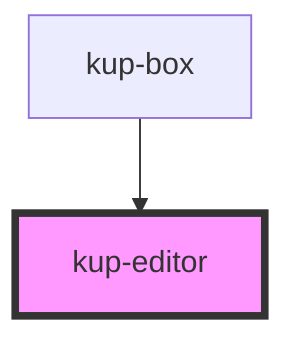

# kup-editor

<!-- Auto Generated Below -->

## Properties

| Property | Attribute | Description                        | Type     | Default |
| -------- | --------- | ---------------------------------- | -------- | ------- |
| `text`   | `text`    | The html to be rendered and edited | `string` | `''`    |

## CSS Custom Properties

| Name                                | Description                                                |
| ----------------------------------- | ---------------------------------------------------------- |
| `--edt_height, --kup-editor_height` | Specifies the height the frame must have. Default: 600px ; |
| `--edt_width, --kup-editor_width`   | Specifies the width of the frame Default: 100% ;           |

## Dependencies

### Used by

 - [kup-box](../kup-box)

### Graph

----------------------------------------------

*Built with [StencilJS](https://stenciljs.com/)*
