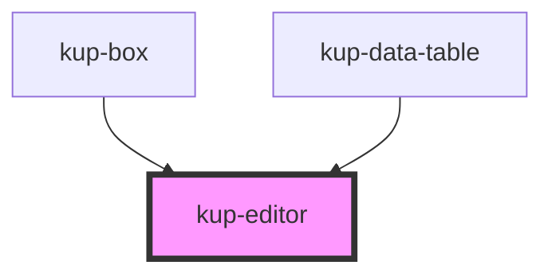

# kup-editor

<!-- Auto Generated Below -->

## Properties

| Property | Attribute | Description                        | Type     | Default |
| -------- | --------- | ---------------------------------- | -------- | ------- |
| `text`   | `text`    | The html to be rendered and edited | `string` | `''`    |

## Dependencies

### Used by

 - [kup-box](../kup-box)
 - [kup-data-table](../kup-data-table)

### Graph

----------------------------------------------

*Built with [StencilJS](https://stenciljs.com/)*
