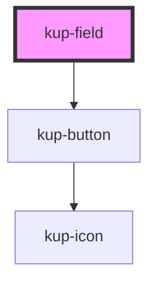

# kup-field

<!-- Auto Generated Below -->

## Properties

| Property      | Attribute      | Description                                                                                      | Type      | Default     |
| ------------- | -------------- | ------------------------------------------------------------------------------------------------ | --------- | ----------- |
| `customStyle` | `custom-style` | Custom style to be passed to the component.                                                      | `string`  | `undefined` |
| `data`        | --             | Effective data to pass to the component.                                                         | `Object`  | `{}`        |
| `label`       | `label`        | The text of the label. If set to empty or has only white space chars, the label will be removed. | `string`  | `''`        |
| `labelPos`    | `label-pos`    | Sets the label's position, left right or top.                                                    | `string`  | `'left'`    |
| `showSubmit`  | `show-submit`  | Sets whether the submit button must be displayed or not.                                         | `boolean` | `false`     |
| `submitLabel` | `submit-label` | Sets the submit button's label.                                                                  | `string`  | `''`        |
| `submitPos`   | `submit-pos`   | Sets the submit button's position, top right bottom or left.                                     | `string`  | `'right'`   |
| `type`        | `type`         | The type of the FLD                                                                              | `string`  | `undefined` |

## Events

| Event          | Description                                                                 | Type                             |
| -------------- | --------------------------------------------------------------------------- | -------------------------------- |
| `kupFldChange` | Launched when the value of the current FLD changes.                         | `CustomEvent<KupFldChangeEvent>` |
| `kupFldSubmit` | Launched when the FLD values are confirmed and a submit event is triggered. | `CustomEvent<KupFldSubmitEvent>` |

## Methods

### `getCurrentValue() => Promise<string | object>`

Provides an interface to get the current value programmatically

#### Returns

Type: `Promise<string | object>`

## Dependencies

### Depends on

- [kup-button](../kup-button)

### Graph

----------------------------------------------

*Built with [StencilJS](https://stenciljs.com/)*
