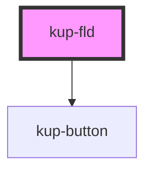

# kup-fld

<!-- Auto Generated Below -->

## Properties

| Property      | Attribute      | Description                                                                                           | Type               | Default     |
| ------------- | -------------- | ----------------------------------------------------------------------------------------------------- | ------------------ | ----------- |
| `config`      | `config`       | Data the FLD must parse to fully be configured. It must be either an Object or a JSON parsable string | `object \| string` | `''`        |
| `customStyle` | `custom-style` | Custom style to be passed to the component.                                                           | `string`           | `undefined` |
| `data`        | `data`         | Effective data to pass to the component                                                               | `any`              | `undefined` |

## Events

| Event          | Description                                                                 | Type                             |
| -------------- | --------------------------------------------------------------------------- | -------------------------------- |
| `kupFldChange` | Launched when the value of the current FLD changes.                         | `CustomEvent<KupFldChangeEvent>` |
| `kupFldSubmit` | Launched when the FLD values are confirmed and a submit event is triggered. | `CustomEvent<KupFldSubmitEvent>` |

## Methods

### `getCurrentValue() => Promise<string | object>`

Provides an interface to get the current value programmatically

#### Returns

Type: `Promise<string | object>`

## CSS Custom Properties

| Name                                            | Description                                                                  |
| ----------------------------------------------- | ---------------------------------------------------------------------------- |
| `--fld_comp-margin, --kup-fld_component-margin` | Specifies internal margin between label, submit button and dynamic component |

## Dependencies

### Depends on

- [kup-button](../kup-button)

### Graph

----------------------------------------------

*Built with [StencilJS](https://stenciljs.com/)*
