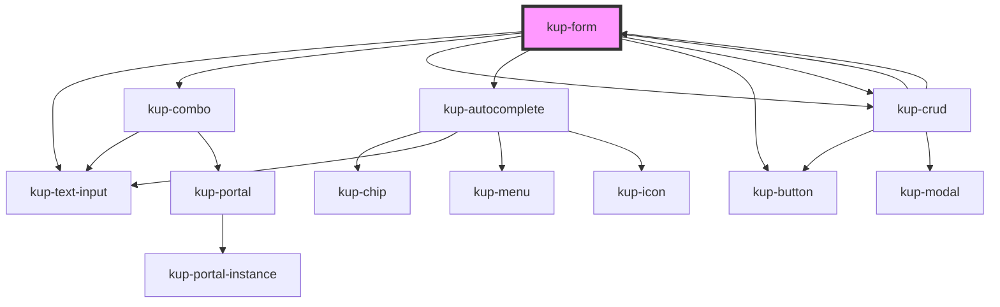

# kup-form

Kup-form is a web component that allows to generate forms.

## Fields

Fields config, layout and values are defined in fields prop. Each field must have a unique key prop. Field value can be a string or a object.

## Sections

Fields can be organized in sections. Sections can also contains other sections. To define sections use the sections prop.

## Validation

By default fields are checked with client validation rules when a form action is submitted.

If you set a liveCheck=true inside config prop, everytime a field value is changed it will be client checked. NB: for input texts the value change will fire when the element loses focus, not immediately after the modification.

If you want to add a server side check everytime a field value is changed you can put a param in the 'extra' prop of a field (for example liveBackendCheck=true) and read it on the FormFieldChanged event.

## Extra messages

When a form is submitted or when another form event is performed some backend logic can be executed. In this case you can have the need to show some backend messages (for example backend check messages) inside the form.

You can show these kind of messages using the extraMessages prop.

## Actions

As default, if actions prop is empty, a submit button and a reset button (not yet implemented) will be rendered in the bottom right of the form. The reset will empty all fields when clicked.

If you want to add actions or customize submit and/or reset buttons (or hide them) you have to set actions prop. You have to define both actions fields (they are button widget so you can add all the attributes of a BTN shape or J4BTN object) and actions sections. There are only four possibile sections with position: TL (top left), TR (top right), BL (bottom left), BR (bottom right). As a form field an action field must have a unique key. Submit action has "submit" key, reset action has "reset" key. Performing an action will generate a kupFormActionSubmitted event.

## State

The props: config, fields, sections, extraMessages are mutable (they can be updated by the component) and they are syncronized with the actual state of that entities. So if you want to obtain the actual state of fields (for example actual fields values) you can use fields props from the component (using for example: this.\$refs.form.fields).

During events all the state of the component isn't sent. So if you need some state info on event you can use props.

---

<!-- Auto Generated Below -->

## Properties

| Property                             | Attribute | Description | Type                                                                               | Default     |
| ------------------------------------ | --------- | ----------- | ---------------------------------------------------------------------------------- | ----------- |
| `actions`                            | --        |             | `FormActions`                                                                      | `undefined` |
| `autocompleteCallBackOnFilterUpdate` | --        |             | `(detail: KupAutocompleteFilterUpdatePayload) => Promise<KupAutocompleteOption[]>` | `undefined` |
| `config`                             | --        |             | `FormConfig`                                                                       | `{}`        |
| `crudCallBackOnFormActionSubmitted`  | --        |             | `(detail: FormActionEventDetail) => Promise<CrudCallBackOnFormEventResult>`        | `undefined` |
| `crudCallBackOnFormFieldChanged`     | --        |             | `(detail: FormFieldEventDetail) => Promise<CrudCallBackOnFormEventResult>`         | `undefined` |
| `extra`                              | `extra`   |             | `any`                                                                              | `undefined` |
| `extraMessages`                      | --        |             | `FormMessage[]`                                                                    | `[]`        |
| `fields`                             | --        |             | `FormFields`                                                                       | `undefined` |
| `refid`                              | `refid`   |             | `string`                                                                           | `undefined` |
| `sections`                           | --        |             | `FormSection`                                                                      | `undefined` |

## Events

| Event                    | Description | Type                                 |
| ------------------------ | ----------- | ------------------------------------ |
| `kupFormActionSubmitted` |             | `CustomEvent<FormActionEventDetail>` |
| `kupFormFieldBlurred`    |             | `CustomEvent<FormFieldEventDetail>`  |
| `kupFormFieldChanged`    |             | `CustomEvent<FormFieldEventDetail>`  |
| `kupFormFieldFocused`    |             | `CustomEvent<FormFieldEventDetail>`  |

## CSS Custom Properties

| Name                                                                   | Description                        |
| ---------------------------------------------------------------------- | ---------------------------------- |
| `--form_border-color, --kup-form_border-color`                         | form border color                  |
| `--form_border-radius, --kup-form_border-radius`                       | form border radius                 |
| `--form_color, --kup-form_color`                                       | text color                         |
| `--form_titled-section-bg-color, --kup-form_titled-section-bg-color`   | background color for section title |
| `--form_titled-section-font-size, --kup-form_titled-section-font-size` | font size for section title        |
| `--form_titled-section-top, --kup-form_titled-section-top`             | top position for section title     |

## Dependencies

### Used by

 - [kup-crud](../kup-crud)

### Depends on

- [kup-text-input](../kup-text-input)
- [kup-combo](../kup-combo)
- [kup-crud](../kup-crud)
- [kup-autocomplete](../kup-autocomplete)
- [kup-button](../kup-button)
- [kup-crud](../kup-crud)

### Graph

----------------------------------------------

*Built with [StencilJS](https://stenciljs.com/)*
