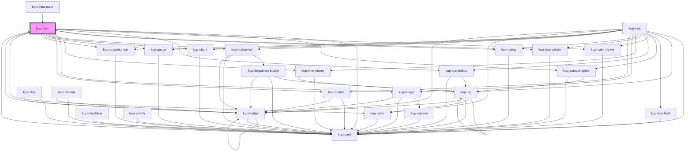

# kup-form

<!-- Auto Generated Below -->

## Properties

| Property             | Attribute              | Description                                                            | Type            | Default |
| -------------------- | ---------------------- | ---------------------------------------------------------------------- | --------------- | ------- |
| `customStyle`        | `custom-style`         | Custom style of the component.                                         | `string`        | `''`    |
| `data`               | --                     | Actual data of the form.                                               | `KupFormData`   | `null`  |
| `hiddenSubmitButton` | `hidden-submit-button` | Creates a hidden submit button in order to submit the form with enter. | `boolean`       | `false` |
| `layout`             | --                     | How the form will arrange its content.                                 | `KupFormLayout` | `null`  |

## Methods

### `getProps(descriptions?: boolean) => Promise<GenericObject>`

Used to retrieve component's props values.

#### Returns

Type: `Promise<GenericObject>`

List of props as object, each key will be a prop.

### `refresh() => Promise<void>`

This method is used to trigger a new render of the component.

#### Returns

Type: `Promise<void>`

### `setFocus(column: string, rowId: string) => Promise<void>`

Sets the focus on an editable table cell.

#### Returns

Type: `Promise<void>`

### `setProps(props: GenericObject) => Promise<void>`

Sets the props to the component.

#### Returns

Type: `Promise<void>`

## CSS Custom Properties

| Name                          | Description                        |
| ----------------------------- | ---------------------------------- |
| `--kup-form-background-color` | Sets background of the component.  |
| `--kup-form-color`            | Sets text color of the component.  |
| `--kup-form-font-family`      | Sets font family of the component. |
| `--kup-form-font-size`        | Sets font size of the component.   |
| `--kup-form-label-alignment`  | Sets the text alignment of labels. |
| `--kup-form-label-width`      | Sets the width of labels.          |

## Dependencies

### Used by

 - [kup-card](../kup-card)
 - [kup-data-table](../kup-data-table)

### Depends on

- [kup-card](../kup-card)
- [kup-autocomplete](../kup-autocomplete)
- [kup-color-picker](../kup-color-picker)
- [kup-combobox](../kup-combobox)
- [kup-date-picker](../kup-date-picker)
- [kup-rating](../kup-rating)
- [kup-time-picker](../kup-time-picker)
- [kup-image](../kup-image)
- [kup-button](../kup-button)
- [kup-button-list](../kup-button-list)
- [kup-chart](../kup-chart)
- [kup-gauge](../kup-gauge)
- [kup-progress-bar](../kup-progress-bar)
- [kup-radio](../kup-radio)
- [kup-badge](../kup-badge)

### Graph

----------------------------------------------

*Built with [StencilJS](https://stenciljs.com/)*
