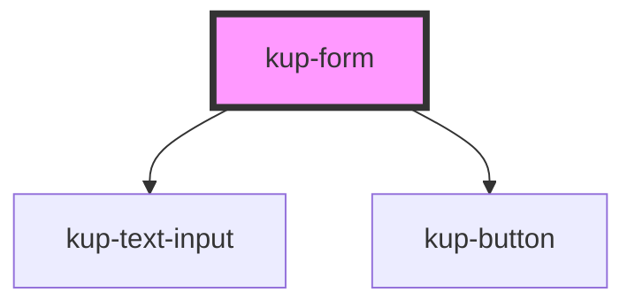

# kup-form

Kup-form is a web component that allows to generate forms.

## Fields

Fields config, layout and values are defined in fields prop.

## Sections

Fields can be organized in sections. Sections can also contains other sections. To define sections use the sections prop.

## Validation

By default fields values are validated when the form is submitted or when the fields prop is updated.

If you set a liveValidate=true inside config prop everytime a field is blurred a form validation is performed.

## Extra messages

When a form is submitted or when another form event is performed some backend logic can be executed. In this case you can have the need to show some backend messages (for example backend validation messages) inside the form.

You can show these kind of messages using the extraMessages prop.

---

<!-- Auto Generated Below -->

## Properties

| Property        | Attribute | Description | Type            | Default     |
| --------------- | --------- | ----------- | --------------- | ----------- |
| `config`        | --        |             | `FormConfig`    | `{}`        |
| `extraMessages` | --        |             | `FormMessage[]` | `[]`        |
| `fields`        | --        |             | `FormFields`    | `undefined` |
| `sections`      | --        |             | `FormSection`   | `undefined` |

## Events

| Event                 | Description | Type                                  |
| --------------------- | ----------- | ------------------------------------- |
| `kupFormFieldBlurred` |             | `CustomEvent<FormFieldBlurredDetail>` |
| `kupFormFieldFocused` |             | `CustomEvent<FormFieldFocusedDetail>` |
| `kupFormSubmitted`    |             | `CustomEvent<FormSubmittedDetail>`    |

## CSS Custom Properties

| Name                                                                   | Description                        |
| ---------------------------------------------------------------------- | ---------------------------------- |
| `--form_border-color, --kup-form_border-color`                         | form border color                  |
| `--form_border-radius, --kup-form_border-radius`                       | form border radius                 |
| `--form_color, --kup-form_color`                                       | text color                         |
| `--form_titled-section-bg-color, --kup-form_titled-section-bg-color`   | background color for section title |
| `--form_titled-section-font-size, --kup-form_titled-section-font-size` | font size for section title        |
| `--form_titled-section-top, --kup-form_titled-section-top`             | top position for section title     |

## Dependencies

### Depends on

- [kup-text-input](../kup-text-input)
- [kup-button](../kup-button)

### Graph

----------------------------------------------

*Built with [StencilJS](https://stenciljs.com/)*
