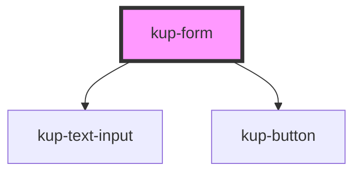

# kup-form

<!-- Auto Generated Below -->

## Properties

| Property   | Attribute | Description | Type          | Default     |
| ---------- | --------- | ----------- | ------------- | ----------- |
| `fields`   | --        |             | `FormFields`  | `undefined` |
| `sections` | --        |             | `FormSection` | `undefined` |

## Events

| Event                 | Description | Type                                  |
| --------------------- | ----------- | ------------------------------------- |
| `kupFormFieldFocused` |             | `CustomEvent<FormFieldFocusedDetail>` |
| `kupFormSubmitted`    |             | `CustomEvent<FormSubmittedDetail>`    |

## CSS Custom Properties

| Name                                                                   | Description                        |
| ---------------------------------------------------------------------- | ---------------------------------- |
| `--form_border-color, --kup-form_border-color`                         | form border color                  |
| `--form_border-radius, --kup-form_border-radius`                       | form border radius                 |
| `--form_color, --kup-form_color`                                       | text color                         |
| `--form_titled-section-bg-color, --kup-form_titled-section-bg-color`   | background color for section title |
| `--form_titled-section-font-size, --kup-form_titled-section-font-size` | font size for section title        |
| `--form_titled-section-top, --kup-form_titled-section-top`             | top position for section title     |

## Dependencies

### Depends on

- [kup-text-input](../kup-text-input)
- [kup-button](../kup-button)

### Graph

----------------------------------------------

*Built with [StencilJS](https://stenciljs.com/)*
