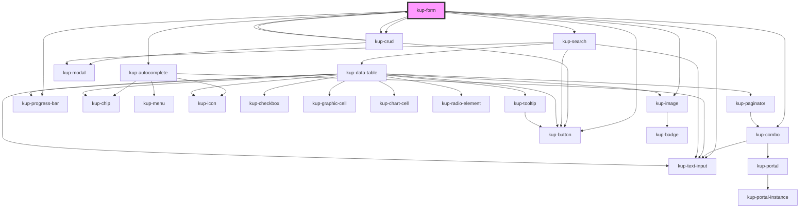

# kup-form

Kup-form is a web component that allows to generate forms.

## Fields

Fields config and layout are defined in a prop called fields. Each field must have a unique key prop.

## Cells

Fields values are in a prop called cells. In a cell you can find values but also some specific data, like a shape config or extra or obj props.

## Extra and obj

Extra is a any attribute that can contain all you want to be transferred during events (for example some backed useful params). Obj is a more specific type of info that will be always transferred during events, like extra. Obj contains a type, a parameter and a code. You can put extra and obj at field level, at cell level, at actions level, at component level, and they will always be transferred during events.

## Sections

Fields can be organized in sections. Sections can also contains other sections. To define sections use the sections prop.

## Validation

By default fields are checked with client validation rules when a form action is submitted.

If you set a liveCheck=true inside config prop, everytime a field value is changed it will be client checked. NB: for input texts the value change will fire when the element loses focus, not immediately after the modification.

If you want to add a server side check everytime a field value is changed you can put a param in the 'extra' prop of a field (for example liveBackendCheck=true) and read it on the FormFieldChanged event.

## Actions

As default, if actions prop is empty, a submit button and a reset button (not yet implemented) will be rendered in the bottom right of the form. The reset will empty all fields when clicked.

If you want to add actions or customize submit and/or reset buttons (or hide them) you have to set actions prop. You have to define both actions fields (they are button widget so you can add all the attributes of a BTN shape or J4BTN object field while the value will be the title) and actions sections. There are only four possibile sections with position: TL (top left), TR (top right), BL (bottom left), BR (bottom right). As a form field an action field must have a unique key. Submit action has "submit" key, reset action has "reset" key. Performing an action will generate a kupFormActionSubmitted event.

## Extra messages

When a form is submitted or when another form event is performed some backend logic can be executed. In this case you can have the need to show some backend messages (for example backend check messages) inside the form.

You can show these kind of messages using the extraMessages prop.

## Old values

When a FormActionEvent or a FormFieldEvent is sent you will obtain in the payload the actual state of the cells and the old one. The old is the copy of the cells stored when you set or reset the cells prop into the form.

---

<!-- Auto Generated Below -->

## Properties

| Property                             | Attribute | Description | Type                                                                               | Default     |
| ------------------------------------ | --------- | ----------- | ---------------------------------------------------------------------------------- | ----------- |
| `actions`                            | --        |             | `FormActions`                                                                      | `undefined` |
| `autocompleteCallBackOnFilterUpdate` | --        |             | `(detail: KupAutocompleteFilterUpdatePayload) => Promise<KupAutocompleteOption[]>` | `undefined` |
| `cells`                              | --        |             | `FormCells`                                                                        | `undefined` |
| `config`                             | --        |             | `FormConfig`                                                                       | `undefined` |
| `crudCallBackOnFormActionSubmitted`  | --        |             | `(detail: FormActionEventDetail) => Promise<CrudCallBackOnFormEventResult>`        | `undefined` |
| `crudCallBackOnFormFieldChanged`     | --        |             | `(detail: FormFieldEventDetail) => Promise<CrudCallBackOnFormEventResult>`         | `undefined` |
| `extra`                              | `extra`   |             | `any`                                                                              | `undefined` |
| `extraMessages`                      | --        |             | `FormMessage[]`                                                                    | `[]`        |
| `fields`                             | --        |             | `FormFields`                                                                       | `undefined` |
| `refid`                              | `refid`   |             | `string`                                                                           | `undefined` |
| `searchCallBackOnFilterSubmitted`    | --        |             | `(detail: SearchFilterSubmittedEventDetail) => Promise<TableData>`                 | `undefined` |
| `sections`                           | --        |             | `FormSection`                                                                      | `undefined` |

## Events

| Event                    | Description | Type                                 |
| ------------------------ | ----------- | ------------------------------------ |
| `kupFormActionSubmitted` |             | `CustomEvent<FormActionEventDetail>` |
| `kupFormFieldBlurred`    |             | `CustomEvent<FormFieldEventDetail>`  |
| `kupFormFieldChanged`    |             | `CustomEvent<FormFieldEventDetail>`  |
| `kupFormFieldFocused`    |             | `CustomEvent<FormFieldEventDetail>`  |

## Methods

### `getActualCells() => Promise<FormCells>`

#### Returns

Type: `Promise<FormCells>`

### `getOldCells() => Promise<FormCells>`

#### Returns

Type: `Promise<FormCells>`

## CSS Custom Properties

| Name                                                                   | Description                        |
| ---------------------------------------------------------------------- | ---------------------------------- |
| `--form_border-color, --kup-form_border-color`                         | form border color                  |
| `--form_border-radius, --kup-form_border-radius`                       | form border radius                 |
| `--form_color, --kup-form_color`                                       | text color                         |
| `--form_titled-section-bg-color, --kup-form_titled-section-bg-color`   | background color for section title |
| `--form_titled-section-font-size, --kup-form_titled-section-font-size` | font size for section title        |
| `--form_titled-section-top, --kup-form_titled-section-top`             | top position for section title     |

## Dependencies

### Used by

 - [kup-crud](../kup-crud)

### Depends on

- [kup-combo](../kup-combo)
- [kup-crud](../kup-crud)
- [kup-autocomplete](../kup-autocomplete)
- [kup-search](../kup-search)
- [kup-image](../kup-image)
- [kup-progress-bar](../kup-progress-bar)
- [kup-text-input](../kup-text-input)
- [kup-button](../kup-button)
- [kup-crud](../kup-crud)

### Graph

----------------------------------------------

*Built with [StencilJS](https://stenciljs.com/)*
