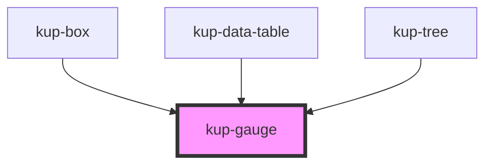

# kup-gauge

## Usage

Currently, this component depends on the two following scripts:

```javascript
<script src="https://d3js.org/d3-path.v1.min.js"></script>
<script src="https://d3js.org/d3-shape.v1.min.js"></script>
```

These scripts must be included into the head tag of the page before including Stencil project.

Our intention is to remove these dependencies as soon as possible.

##### Font size

To specify the font size of the text elements of the SVG it's sufficient to set the `font-size` property on the component itself. This property will change the size of both the threshold and value labels.

### Useful references for this component

https://codepen.io/enxaneta/pen/EVYRJJ

##### Svg syntax

https://css-tricks.com/transforms-on-svg-elements/ https://css-tricks.com/svg-path-syntax-illustrated-guide/ https://developer.mozilla.org/it/docs/Web/SVG/Element https://developer.mozilla.org/en-US/docs/Web/SVG/Attribute/transform

##### Gauge examples

https://plnkr.co/edit/LJlKKX1xnVwl2LoFBFoO?p=preview https://stackoverflow.com/questions/52373021/d3-js-add-label-along-the-arc

##### D3 library reference

https://github.com/d3?utf8=%E2%9C%93&q=&type=&language= https://github.com/d3/d3-shape#arcs https://github.com/d3/d3/blob/master/API.md

##### React Style syntax

https://stackoverflow.com/questions/26882177/react-js-inline-style-best-practices

##### Less useful things

http://www.pindari.com/svg-arc.html http://bl.ocks.org/msqr/3202712

### Idea for creating dynamic margin for correct visualization of the labels

Fundamentally, the main problem here is that that if

```javascript
  // Gauge ref
  private gaugeRef: SVGElement;
  //---- LifeCycle hooks ----
  componentDidLoad() {
    this.setComponentPadding();
  }

  componentDidUpdate() {
    this.setComponentPadding();
  }

  //---- Rendering functions ----
  setComponentPadding() {
    console.log("si è aggiornato", this.gaugeRef);
    const allTexts = this.gaugeRef.querySelectorAll('text');
    // Searches all text elements and compares their length
    // The longest element width gets set to the left and right of the component's padding
    // The height of one of the labels gets added on the padding-top
  }

  // Inside the render function on the svg element
  ref={(el) => this.gaugeRef = el as SVGElement}
```

<!-- Auto Generated Below -->


## Properties

| Property          | Attribute          | Description                                                                                                                          | Type       | Default                                                                                                                                               |
| ----------------- | ------------------ | ------------------------------------------------------------------------------------------------------------------------------------ | ---------- | ----------------------------------------------------------------------------------------------------------------------------------------------------- |
| `arcThickness`    | `arc-thickness`    | Sets how much the arc of the gauge should be thick.                                                                                  | `number`   | `30`                                                                                                                                                  |
| `colors`          | --                 | Array of three elements to specify the color of the arcs.                                                                            | `string[]` | `[         `var(${KupThemeColorValues.SUCCESS})`,         `var(${KupThemeColorValues.WARNING})`,         `var(${KupThemeColorValues.DANGER})`,     ]` |
| `customStyle`     | `custom-style`     | Custom style of the component. For more information: https://ketchup.smeup.com/ketchup-showcase/#/customization                      | `string`   | `''`                                                                                                                                                  |
| `firstThreshold`  | `first-threshold`  | The first threshold, establishing the length of the first and second arc.                                                            | `number`   | `undefined`                                                                                                                                           |
| `labelDistance`   | `label-distance`   | The distance the label and the value has from the gauge graph.                                                                       | `number`   | `20`                                                                                                                                                  |
| `maxValue`        | `max-value`        | The maximum value reachable in the current graph.                                                                                    | `number`   | `100`                                                                                                                                                 |
| `measurementUnit` | `measurement-unit` | A string which will be appended to the displayed values of the component.                                                            | `string`   | `''`                                                                                                                                                  |
| `minValue`        | `min-value`        | The minimum value reachable in the current graph.                                                                                    | `number`   | `-100`                                                                                                                                                |
| `needleCircle`    | `needle-circle`    | When true, shows a rounded needle.                                                                                                   | `boolean`  | `false`                                                                                                                                               |
| `onlyValue`       | `only-value`       | When true, ignore thresholds in gauge and show colored value's arc.                                                                  | `boolean`  | `false`                                                                                                                                               |
| `reverseColors`   | `reverse-colors`   | When true, the colors inside the colors array are used in the reversed order.                                                        | `boolean`  | `false`                                                                                                                                               |
| `secondThreshold` | `second-threshold` | The second threshold, establishing the length of the second and third arc.                                                           | `number`   | `undefined`                                                                                                                                           |
| `showLabels`      | `show-labels`      | If set to false, threshold values of the gauge are not displayed.                                                                    | `boolean`  | `true`                                                                                                                                                |
| `showMaxmin`      | `show-maxmin`      | If set to false, the maximum and minimum values of the gauge are not displayed.                                                      | `boolean`  | `true`                                                                                                                                                |
| `showValue`       | `show-value`       | If set to false, the current value of the gauge is not displayed.                                                                    | `boolean`  | `true`                                                                                                                                                |
| `size`            | `size`             | Con be used change the viewbox of the SVG. By manipulating this value, some customizations of the aspect of the gauge is achievable. | `number`   | `300`                                                                                                                                                 |
| `value`           | `value`            | The current value of the gauge. The gauge's needle points to the percentage based on this prop.                                      | `number`   | `0`                                                                                                                                                   |
| `valueSize`       | `value-size`       | The current size of gauge's value. Correct values are: 0,1,2 or 3.                                                                   | `number`   | `0`                                                                                                                                                   |
| `widthComponent`  | `width-component`  | Set Width gauge.                                                                                                                     | `string`   | `'100%'`                                                                                                                                              |


## Methods

### `getProps(descriptions?: boolean) => Promise<GenericObject>`

Used to retrieve component's props values.

#### Returns

Type: `Promise<GenericObject>`


### `refresh() => Promise<void>`

This method is used to trigger a new render of the component.

#### Returns

Type: `Promise<void>`


### `setProps(props: GenericObject) => Promise<void>`

Sets the props to the component.

#### Returns

Type: `Promise<void>`


## Dependencies

### Used by

 - [kup-box](../kup-box)
 - [kup-data-table](../kup-data-table)
 - [kup-tree](../kup-tree)

### Graph


----------------------------------------------

*Built with [StencilJS](https://stenciljs.com/)*
