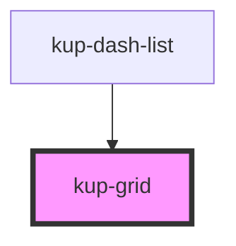

# kup-grid

<!-- Auto Generated Below -->

## Properties

| Property      | Attribute      | Description                                                              | Type      | Default |
| ------------- | -------------- | ------------------------------------------------------------------------ | --------- | ------- |
| `columns`     | `columns`      | The number of columns displayed by the grid, the default behavior is 12. | `number`  | `12`    |
| `customStyle` | `custom-style` | Custom style of the component.                                           | `string`  | `''`    |
| `singleLine`  | `single-line`  | When set to true, forces the content on a single line.                   | `boolean` | `false` |

## Methods

### `getProps(descriptions?: boolean) => Promise<GenericObject>`

Used to retrieve component's props values.

#### Returns

Type: `Promise<GenericObject>`

List of props as object, each key will be a prop.

### `refresh() => Promise<void>`

This method is used to trigger a new render of the component.

#### Returns

Type: `Promise<void>`

### `setProps(props: GenericObject) => Promise<void>`

Sets the props to the component.

#### Returns

Type: `Promise<void>`

## CSS Custom Properties

| Name                    | Description                                 |
| ----------------------- | ------------------------------------------- |
| `--kup-grid-font-size`  | Sets font size of the component.            |
| `--kup-grid-gap`        | Sets gap of the grid.                       |
| `--kup-grid-gap-mobile` | Sets gap of the grid for lower resolutions. |
| `--kup-grid-padding`    | Sets padding of the outer layer.            |

## Dependencies

### Used by

 - [kup-dash-list](../kup-dash-list)

### Graph

----------------------------------------------

*Built with [StencilJS](https://stenciljs.com/)*
