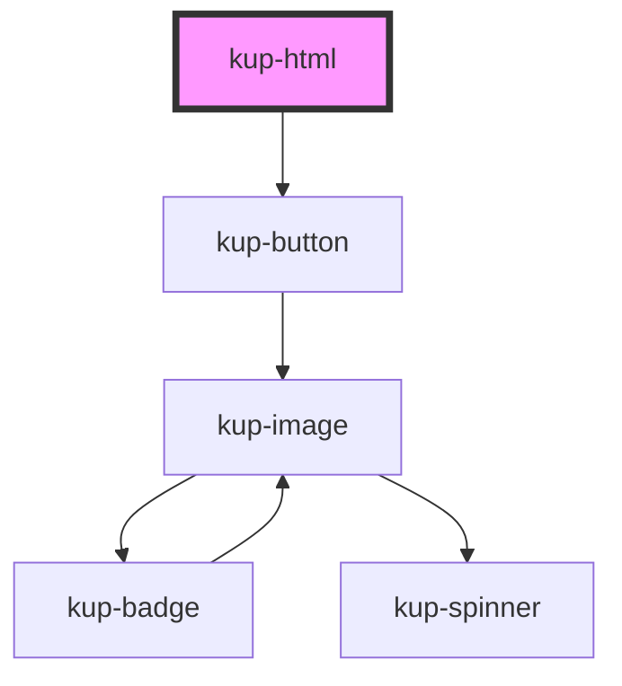

# kup-html

<!-- Auto Generated Below -->

## Properties

| Property   | Attribute   | Description                                        | Type      | Default                  |
| ---------- | ----------- | -------------------------------------------------- | --------- | ------------------------ |
| `isButton` | `is-button` | If true, the kup-html takes the shape of a button  | `boolean` | `false`                  |
| `label`    | `label`     | The label to show when button isButton is active   | `string`  | `'Open in a new window'` |
| `src`      | `src`       | The address which must be referenced by the iframe | `string`  | `''`                     |

## Events

| Event               | Description                                | Type               |
| ------------------- | ------------------------------------------ | ------------------ |
| `ketchupHtmlError`  | When loading the frame has thrown an error | `CustomEvent<any>` |
| `ketchupHtmlLoaded` | When the iframe has been loaded            | `CustomEvent<any>` |

## Dependencies

### Depends on

- [kup-button](../kup-button)

### Graph

----------------------------------------------

*Built with [StencilJS](https://stenciljs.com/)*
