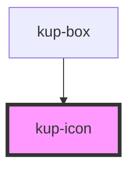

# kup-icon

<!-- Auto Generated Below -->

## Properties

| Property          | Attribute    | Description | Type       | Default                      |
| ----------------- | ------------ | ----------- | ---------- | ---------------------------- |
| `iconClass`       | `icon-class` |             | `string`   | `undefined`                  |
| `iconStyle`       | --           |             | `{}`       | `undefined`                  |
| `iconStylesheets` | --           |             | `string[]` | `[KupIcon.DEFAULT_ICON_URL]` |
| `imageSrc`        | `image-src`  |             | `string`   | `undefined`                  |

## Dependencies

### Used by

 - [kup-box](..\kup-box)

### Graph

----------------------------------------------

*Built with [StencilJS](https://stenciljs.com/)*
