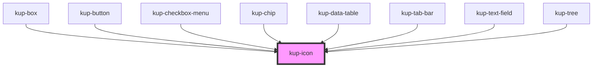

# wup-template

<!-- Auto Generated Below -->

## Properties

| Property      | Attribute      | Description                                                                                | Type     | Default                   |
| ------------- | -------------- | ------------------------------------------------------------------------------------------ | -------- | ------------------------- |
| `color`       | `color`        | The color of the icon, defaults to the main color of the app.                              | `string` | `'var(--kup-icon-color)'` |
| `customStyle` | `custom-style` | Custom style to be passed to the component.                                                | `string` | `undefined`               |
| `name`        | `name`         | The name of the icon.                                                                      | `string` | `undefined`               |
| `sizeX`       | `size-x`       | The width of the icon, defaults to 100%. Accepts any CSS width format (px, %, vh, etc.).   | `string` | `'100%'`                  |
| `sizeY`       | `size-y`       | The height of the icon, defaults to 100%. Accepts any CSS height format (px, %, vh, etc.). | `string` | `'100%'`                  |
| `type`        | `type`         | The type of the icon, defaults to "svg".                                                   | `string` | `'svg'`                   |

## Dependencies

### Used by

 - [kup-box](../kup-box)
 - [kup-button](../kup-button)
 - [kup-checkbox-menu](../kup-checkbox-menu)
 - [kup-chip](../kup-chip)
 - [kup-data-table](../kup-data-table)
 - [kup-tab-bar](../kup-tab-bar)
 - [kup-text-field](../kup-text-field)
 - [kup-tree](../kup-tree)

### Graph

----------------------------------------------

*Built with [StencilJS](https://stenciljs.com/)*
