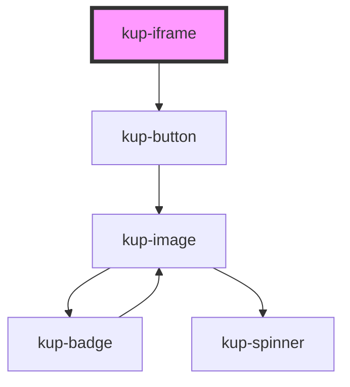

# kup-iframe

<!-- Auto Generated Below -->

## Properties

| Property     | Attribute   | Description                                                                                                            | Type      | Default     |
| ------------ | ----------- | ---------------------------------------------------------------------------------------------------------------------- | --------- | ----------- |
| `buttonData` | --          | Props of the button (when isButton is set to true).                                                                    | `Object`  | `{}`        |
| `isButton`   | `is-button` | The component will be rendered as a button, which opens the link associated to the iframe in another tab when clicked. | `boolean` | `false`     |
| `src`        | `src`       | The address the iframe should be referencing to.                                                                       | `string`  | `undefined` |

## Events

| Event            | Description | Type               |
| ---------------- | ----------- | ------------------ |
| `kupIframeError` |             | `CustomEvent<any>` |
| `kupIframeLoad`  |             | `CustomEvent<any>` |

## Dependencies

### Depends on

- [kup-button](../kup-button)

### Graph

----------------------------------------------

*Built with [StencilJS](https://stenciljs.com/)*
