# kup-image-list

<!-- Auto Generated Below -->

## Properties

| Property       | Attribute      | Description                                                      | Type            | Default     |
| -------------- | -------------- | ---------------------------------------------------------------- | --------------- | ----------- |
| `customStyle`  | `custom-style` | Custom style of the component.                                   | `string`        | `''`        |
| `data`         | --             | Actual data of the component.                                    | `KupDataNode[]` | `[]`        |
| `ripple`       | `ripple`       | When enabled displays Material's ripple effect on clicked items. | `boolean`       | `true`      |
| `selectedNode` | --             | An array of integers containing the path to a selected child.\   | `number[]`      | `[]`        |
| `stateId`      | `state-id`     |                                                                  | `string`        | `''`        |
| `store`        | --             |                                                                  | `KupStore`      | `undefined` |

## Events

| Event                       | Description | Type                                    |
| --------------------------- | ----------- | --------------------------------------- |
| `kup-imagelist-click`       |             | `CustomEvent<KupImageListEventPayload>` |
| `kup-imagelist-contextmenu` |             | `CustomEvent<KupImageListEventPayload>` |
| `kup-imagelist-dblclick`    |             | `CustomEvent<KupImageListEventPayload>` |

## Methods

### `getProps(descriptions?: boolean) => Promise<GenericObject>`

Used to retrieve component's props values.

#### Returns

Type: `Promise<GenericObject>`

List of props as object, each key will be a prop.

### `refresh() => Promise<void>`

This method is used to trigger a new render of the component.

#### Returns

Type: `Promise<void>`

### `setProps(props: GenericObject) => Promise<void>`

Sets the props to the component.

#### Returns

Type: `Promise<void>`

## CSS Custom Properties

| Name                                 | Description                                               |
| ------------------------------------ | --------------------------------------------------------- |
| `--kup-imagelist-background-color`   | Sets the background color of the component.               |
| `--kup-imagelist-columns`            | Sets the number of columns of the grid.                   |
| `--kup-imagelist-grid-gap`           | Sets the gap of the grid.                                 |
| `--kup-imagelist-image-margin`       | Sets the margin of the images.                            |
| `--kup-imagelist-image-min-height`   | Sets the minimun height of the images (useful for icons). |
| `--kup-imagelist-item-border-radius` | Sets the border radius of items.                          |
| `--kup-imagelist-item-height`        | Sets the height of an item.                               |
| `--kup-imagelist-item-padding`       | Sets the padding of an item.                              |
| `--kup-imagelist-item-width`         | Sets the width of an item.                                |
| `--kup-imagelist-label-margin`       | Sets the margin of the labels.                            |
| `--kup-imagelist-primary-color`      | Sets the primary color of the component (ripple effect).  |
| `--kup-imagelist-primary-color-rgb`  | Sets the RGB values of the primary color.                 |
| `--kup-imagelist-text-color`         | Sets the text color of the labels.                        |

## Dependencies

### Depends on

- [kup-card](../kup-card)
- [kup-badge](../kup-badge)
- [kup-autocomplete](../kup-autocomplete)
- [kup-color-picker](../kup-color-picker)
- [kup-combobox](../kup-combobox)
- [kup-date-picker](../kup-date-picker)
- [kup-rating](../kup-rating)
- [kup-time-picker](../kup-time-picker)
- [kup-image](../kup-image)
- [kup-button](../kup-button)
- [kup-button-list](../kup-button-list)
- [kup-chart](../kup-chart)
- [kup-gauge](../kup-gauge)
- [kup-progress-bar](../kup-progress-bar)
- [kup-radio](../kup-radio)

### Graph

```mermaid
graph TD;
  kup-image-list --> kup-card
  kup-image-list --> kup-badge
  kup-image-list --> kup-autocomplete
  kup-image-list --> kup-color-picker
  kup-image-list --> kup-combobox
  kup-image-list --> kup-date-picker
  kup-image-list --> kup-rating
  kup-image-list --> kup-time-picker
  kup-image-list --> kup-image
  kup-image-list --> kup-button
  kup-image-list --> kup-button-list
  kup-image-list --> kup-chart
  kup-image-list --> kup-gauge
  kup-image-list --> kup-progress-bar
  kup-image-list --> kup-radio
  kup-card --> kup-autocomplete
  kup-card --> kup-color-picker
  kup-card --> kup-combobox
  kup-card --> kup-date-picker
  kup-card --> kup-rating
  kup-card --> kup-time-picker
  kup-card --> kup-image
  kup-card --> kup-button
  kup-card --> kup-button-list
  kup-card --> kup-chart
  kup-card --> kup-gauge
  kup-card --> kup-progress-bar
  kup-card --> kup-radio
  kup-card --> kup-badge
  kup-card --> kup-chip
  kup-card --> kup-list
  kup-card --> kup-form
  kup-card --> kup-checkbox
  kup-card --> kup-text-field
  kup-card --> kup-data-table
  kup-card --> kup-spinner
  kup-card --> kup-tab-bar
  kup-card --> kup-tree
  kup-card --> kup-switch
  kup-card --> kup-dropdown-button
  kup-card --> kup-card
  kup-autocomplete --> kup-list
  kup-autocomplete --> kup-card
  kup-list --> kup-list
  kup-list --> kup-radio
  kup-list --> kup-card
  kup-list --> kup-badge
  kup-radio --> kup-card
  kup-badge --> kup-badge
  kup-badge --> kup-card
  kup-color-picker --> kup-card
  kup-combobox --> kup-list
  kup-combobox --> kup-card
  kup-date-picker --> kup-card
  kup-rating --> kup-card
  kup-time-picker --> kup-card
  kup-time-picker --> kup-list
  kup-image --> kup-spinner
  kup-image --> kup-card
  kup-image --> kup-badge
  kup-spinner --> kup-card
  kup-button --> kup-card
  kup-button --> kup-badge
  kup-button-list --> kup-dropdown-button
  kup-button-list --> kup-card
  kup-button-list --> kup-badge
  kup-dropdown-button --> kup-list
  kup-dropdown-button --> kup-card
  kup-dropdown-button --> kup-badge
  kup-chart --> kup-card
  kup-gauge --> kup-card
  kup-progress-bar --> kup-card
  kup-chip --> kup-card
  kup-chip --> kup-badge
  kup-form --> kup-card
  kup-form --> kup-autocomplete
  kup-form --> kup-color-picker
  kup-form --> kup-combobox
  kup-form --> kup-date-picker
  kup-form --> kup-rating
  kup-form --> kup-time-picker
  kup-form --> kup-image
  kup-form --> kup-button
  kup-form --> kup-button-list
  kup-form --> kup-chart
  kup-form --> kup-gauge
  kup-form --> kup-progress-bar
  kup-form --> kup-radio
  kup-form --> kup-badge
  kup-checkbox --> kup-card
  kup-text-field --> kup-card
  kup-data-table --> kup-card
  kup-data-table --> kup-list
  kup-data-table --> kup-switch
  kup-data-table --> kup-button
  kup-data-table --> kup-spinner
  kup-data-table --> kup-form
  kup-data-table --> kup-image
  kup-data-table --> kup-checkbox
  kup-data-table --> kup-combobox
  kup-data-table --> kup-badge
  kup-data-table --> kup-autocomplete
  kup-data-table --> kup-color-picker
  kup-data-table --> kup-date-picker
  kup-data-table --> kup-rating
  kup-data-table --> kup-time-picker
  kup-data-table --> kup-button-list
  kup-data-table --> kup-chart
  kup-data-table --> kup-gauge
  kup-data-table --> kup-progress-bar
  kup-data-table --> kup-radio
  kup-switch --> kup-card
  kup-tab-bar --> kup-card
  kup-tab-bar --> kup-badge
  kup-tree --> kup-card
  kup-tree --> kup-list
  kup-tree --> kup-text-field
  kup-tree --> kup-autocomplete
  kup-tree --> kup-color-picker
  kup-tree --> kup-combobox
  kup-tree --> kup-date-picker
  kup-tree --> kup-rating
  kup-tree --> kup-time-picker
  kup-tree --> kup-image
  kup-tree --> kup-button
  kup-tree --> kup-button-list
  kup-tree --> kup-chart
  kup-tree --> kup-gauge
  kup-tree --> kup-progress-bar
  kup-tree --> kup-radio
  kup-tree --> kup-badge
  style kup-image-list fill:#f9f,stroke:#333,stroke-width:4px
```

----------------------------------------------

*Built with [StencilJS](https://stenciljs.com/)*
