# kup-image-list

<!-- Auto Generated Below -->

## Properties

| Property              | Attribute               | Description                                                        | Type                     | Default     |
| --------------------- | ----------------------- | ------------------------------------------------------------------ | ------------------------ | ----------- |
| `activeNode`          | --                      | When present component will have an active class on node selected. | `KupImageListDataNode`   | `undefined` |
| `columns`             | --                      | Number of columns to display in the grid layout.                   | `number[]`               | `[]`        |
| `customStyle`         | `custom-style`          | Custom style of the component.                                     | `string`                 | `''`        |
| `data`                | --                      | Actual data of the component.                                      | `KupImageListDataNode[]` | `[]`        |
| `leadingLabel`        | `leading-label`         | When present component will have a main label.                     | `string`                 | `null`      |
| `ripple`              | `ripple`                | When enabled displays Material's ripple effect on clicked items.   | `boolean`                | `false`     |
| `rows`                | `rows`                  | Number of rows to display in the grid layout.                      | `number`                 | `null`      |
| `selectedNode`        | --                      | An array of integers containing the path to a selected child.      | `number[]`               | `[]`        |
| `showFullDescription` | `show-full-description` | When enabled images descriptions will be fully shown.              | `boolean`                | `false`     |
| `stateId`             | `state-id`              |                                                                    | `string`                 | `''`        |
| `store`               | --                      |                                                                    | `KupStore`               | `undefined` |

## Events

| Event                       | Description | Type                                    |
| --------------------------- | ----------- | --------------------------------------- |
| `kup-imagelist-click`       |             | `CustomEvent<KupImageListEventPayload>` |
| `kup-imagelist-contextmenu` |             | `CustomEvent<KupImageListEventPayload>` |
| `kup-imagelist-dblclick`    |             | `CustomEvent<KupImageListEventPayload>` |

## Methods

### `getProps(descriptions?: boolean) => Promise<GenericObject>`

Used to retrieve component's props values.

#### Parameters

| Name           | Type      | Description                                                                            |
| -------------- | --------- | -------------------------------------------------------------------------------------- |
| `descriptions` | `boolean` | - When provided and true, the result will be the list of props with their description. |

#### Returns

Type: `Promise<GenericObject>`

List of props as object, each key will be a prop.

### `refresh() => Promise<void>`

This method is used to trigger a new render of the component.

#### Returns

Type: `Promise<void>`

### `setProps(props: GenericObject) => Promise<void>`

Sets the props to the component.

#### Parameters

| Name    | Type            | Description                                                  |
| ------- | --------------- | ------------------------------------------------------------ |
| `props` | `GenericObject` | - Object containing props that will be set to the component. |

#### Returns

Type: `Promise<void>`

## CSS Custom Properties

| Name                                 | Description                                               |
| ------------------------------------ | --------------------------------------------------------- |
| `--kup-imagelist-background-color`   | Sets the background color of the component.               |
| `--kup-imagelist-columns`            | Sets the number of columns of the grid.                   |
| `--kup-imagelist-grid-gap`           | Sets the gap of the grid.                                 |
| `--kup-imagelist-image-margin`       | Sets the margin of the images.                            |
| `--kup-imagelist-image-min-height`   | Sets the minimun height of the images (useful for icons). |
| `--kup-imagelist-item-border-radius` | Sets the border radius of items.                          |
| `--kup-imagelist-item-height`        | Sets the height of an item.                               |
| `--kup-imagelist-item-padding`       | Sets the padding of an item.                              |
| `--kup-imagelist-item-width`         | Sets the width of an item.                                |
| `--kup-imagelist-label-margin`       | Sets the margin of the labels.                            |
| `--kup-imagelist-primary-color`      | Sets the primary color of the component (ripple effect).  |
| `--kup-imagelist-primary-color-rgb`  | Sets the RGB values of the primary color.                 |
| `--kup-imagelist-text-color`         | Sets the text color of the labels.                        |

## Dependencies

### Used by

 - [kup-box](../kup-box)
 - [kup-card](../kup-card)
 - [kup-cell](../kup-cell)
 - [kup-data-table](../kup-data-table)
 - [kup-form](../kup-form)
 - [kup-image-list](.)
 - [kup-input-panel](../kup-input-panel)
 - [kup-toolbar](../kup-toolbar)
 - [kup-tree](../kup-tree)

### Depends on

- [kup-card](../kup-card)
- [kup-dialog](../kup-dialog)
- [kup-badge](../kup-badge)
- [kup-image](../kup-image)
- [kup-autocomplete](../kup-autocomplete)
- [kup-chip](../kup-chip)
- [kup-text-field](../kup-text-field)
- [kup-color-picker](../kup-color-picker)
- [kup-combobox](../kup-combobox)
- [kup-date-picker](../kup-date-picker)
- [kup-file-upload](../kup-file-upload)
- [kup-rating](../kup-rating)
- [kup-time-picker](../kup-time-picker)
- [kup-image-list](.)
- [kup-button-list](../kup-button-list)
- [kup-chart](../kup-chart)
- [kup-gauge](../kup-gauge)
- [kup-progress-bar](../kup-progress-bar)
- [kup-toolbar](../kup-toolbar)

### Graph

```mermaid
graph TD;
  kup-image-list --> kup-image-list
  kup-card --> kup-image-list
  kup-image --> kup-card
  kup-image --> kup-image
  kup-image --> kup-dialog
  kup-image --> kup-spinner
  kup-image --> kup-badge
  kup-dialog --> kup-badge
  kup-dialog --> kup-card
  kup-dialog --> kup-dialog
  kup-badge --> kup-badge
  kup-badge --> kup-card
  kup-badge --> kup-dialog
  kup-spinner --> kup-card
  kup-spinner --> kup-dialog
  kup-autocomplete --> kup-list
  kup-autocomplete --> kup-card
  kup-autocomplete --> kup-dialog
  kup-autocomplete --> kup-badge
  kup-list --> kup-list
  kup-list --> kup-radio
  kup-list --> kup-card
  kup-list --> kup-dialog
  kup-list --> kup-badge
  kup-radio --> kup-card
  kup-radio --> kup-dialog
  kup-radio --> kup-badge
  kup-chip --> kup-card
  kup-chip --> kup-dialog
  kup-chip --> kup-badge
  kup-text-field --> kup-card
  kup-text-field --> kup-dialog
  kup-text-field --> kup-badge
  kup-color-picker --> kup-card
  kup-color-picker --> kup-dialog
  kup-color-picker --> kup-badge
  kup-combobox --> kup-list
  kup-combobox --> kup-card
  kup-combobox --> kup-dialog
  kup-combobox --> kup-badge
  kup-date-picker --> kup-card
  kup-date-picker --> kup-dialog
  kup-date-picker --> kup-badge
  kup-file-upload --> kup-spinner
  kup-file-upload --> kup-card
  kup-file-upload --> kup-dialog
  kup-file-upload --> kup-badge
  kup-rating --> kup-card
  kup-rating --> kup-dialog
  kup-time-picker --> kup-card
  kup-time-picker --> kup-list
  kup-time-picker --> kup-dialog
  kup-time-picker --> kup-badge
  kup-button-list --> kup-dropdown-button
  kup-button-list --> kup-card
  kup-button-list --> kup-dialog
  kup-button-list --> kup-badge
  kup-dropdown-button --> kup-list
  kup-dropdown-button --> kup-card
  kup-dropdown-button --> kup-dialog
  kup-dropdown-button --> kup-badge
  kup-chart --> kup-card
  kup-chart --> kup-dialog
  kup-gauge --> kup-card
  kup-gauge --> kup-dialog
  kup-progress-bar --> kup-card
  kup-progress-bar --> kup-dialog
  kup-toolbar --> kup-image-list
  kup-button --> kup-card
  kup-button --> kup-dialog
  kup-button --> kup-badge
  kup-checkbox --> kup-card
  kup-checkbox --> kup-dialog
  kup-checkbox --> kup-badge
  kup-data-table --> kup-image-list
  kup-switch --> kup-card
  kup-switch --> kup-dialog
  kup-form --> kup-image-list
  kup-tree --> kup-image-list
  kup-tab-bar --> kup-toolbar
  kup-tab-bar --> kup-list
  kup-tab-bar --> kup-card
  kup-tab-bar --> kup-dialog
  kup-tab-bar --> kup-badge
  kup-box --> kup-image-list
  kup-cell --> kup-image-list
  kup-input-panel --> kup-image-list
  style kup-image-list fill:#f9f,stroke:#333,stroke-width:4px
```

----------------------------------------------

*Built with [StencilJS](https://stenciljs.com/)*
