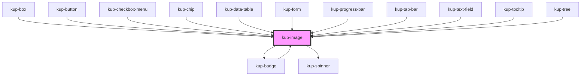

# wup-template

<!-- Auto Generated Below -->

## Properties

| Property      | Attribute      | Description                                                                                               | Type      | Default                   |
| ------------- | -------------- | --------------------------------------------------------------------------------------------------------- | --------- | ------------------------- |
| `badgeData`   | --             | Sets the data of badges.                                                                                  | `Badge[]` | `undefined`               |
| `color`       | `color`        | The color of the icon, defaults to the main color of the app.                                             | `string`  | `'var(--kup-icon-color)'` |
| `customStyle` | `custom-style` | Custom style to be passed to the component.                                                               | `string`  | `undefined`               |
| `feedback`    | `feedback`     | When set to true, a spinner will be displayed until the image finished loading. Not compatible with SVGs. | `boolean` | `false`                   |
| `name`        | `name`         | The name of the icon. It can also contain an URL or a path.                                               | `string`  | `undefined`               |
| `sizeX`       | `size-x`       | The width of the icon, defaults to 100%. Accepts any valid CSS format (px, %, vh, etc.).                  | `string`  | `'100%'`                  |
| `sizeY`       | `size-y`       | The height of the icon, defaults to 100%. Accepts any valid CSS format (px, %, vh, etc.).                 | `string`  | `'100%'`                  |
| `type`        | `type`         | The type of the icon, defaults to "svg".                                                                  | `string`  | `'svg'`                   |

## Events

| Event           | Description | Type                                |
| --------------- | ----------- | ----------------------------------- |
| `kupImageClick` |             | `CustomEvent<{ el: EventTarget; }>` |
| `kupImageLoad`  |             | `CustomEvent<{ el: EventTarget; }>` |

## Dependencies

### Used by

 - [kup-badge](../kup-badge)
 - [kup-box](../kup-box)
 - [kup-button](../kup-button)
 - [kup-checkbox-menu](../kup-checkbox-menu)
 - [kup-chip](../kup-chip)
 - [kup-data-table](../kup-data-table)
 - [kup-form](../kup-form)
 - [kup-progress-bar](../kup-progress-bar)
 - [kup-tab-bar](../kup-tab-bar)
 - [kup-text-field](../kup-text-field)
 - [kup-tooltip](../kup-tooltip)
 - [kup-tree](../kup-tree)

### Depends on

- [kup-badge](../kup-badge)
- [kup-spinner](../kup-spinner)

### Graph

----------------------------------------------

*Built with [StencilJS](https://stenciljs.com/)*
