# wup-template

<!-- Auto Generated Below -->

## Properties

| Property              | Attribute              | Description                                                                                                                                                         | Type           | Default                              |
| --------------------- | ---------------------- | ------------------------------------------------------------------------------------------------------------------------------------------------------------------- | -------------- | ------------------------------------ |
| `badgeData`           | --                     | Sets the data of badges.                                                                                                                                            | `KupBadge[]`   | `null`                               |
| `color`               | `color`                | The color of the icon, defaults to the CSS variable KupThemeColorValues.ICON.                                                                                       | `string`       | ``var(${KupThemeColorValues.ICON})`` |
| `customStyle`         | `custom-style`         | Custom style of the component.                                                                                                                                      | `string`       | `''`                                 |
| `data`                | --                     | When present, the component will be drawn using CSS. Check the 'Drawing with CSS' section of the image showcase for more information.                               | `FImageData[]` | `null`                               |
| `feedback`            | `feedback`             | When set to true, a spinner will be displayed until the image finished loading. Not compatible with SVGs.                                                           | `boolean`      | `false`                              |
| `isCanvas`            | `is-canvas`            | The image component will create a canvas element on which it's possible to draw. It's a temporary feature that will be fully replaced by CSS drawing in the future. | `boolean`      | `false`                              |
| `placeholderResource` | `placeholder-resource` | An SVG that will be displayed until the image is loaded.                                                                                                            | `string`       | `''`                                 |
| `resource`            | `resource`             | The resource used to fetch the image.                                                                                                                               | `string`       | `null`                               |
| `sizeX`               | `size-x`               | The width of the icon, defaults to 100%. Accepts any valid CSS format (px, %, vh, etc.).                                                                            | `string`       | `'100%'`                             |
| `sizeY`               | `size-y`               | The height of the icon, defaults to 100%. Accepts any valid CSS format (px, %, vh, etc.).                                                                           | `string`       | `'100%'`                             |
| `zoomEnable`          | `zoom-enable`          | When set to true, a dialog will be displayed with the same resource set to 100% when image is clicked.                                                              | `boolean`      | `false`                              |

## Events

| Event             | Description | Type                                     |
| ----------------- | ----------- | ---------------------------------------- |
| `kup-image-click` |             | `CustomEvent<KupImageClickEventPayload>` |
| `kup-image-load`  |             | `CustomEvent<KupImageClickEventPayload>` |

## Methods

### `getProps(descriptions?: boolean) => Promise<GenericObject>`

Used to retrieve component's props values.

#### Parameters

| Name           | Type      | Description                                                                            |
| -------------- | --------- | -------------------------------------------------------------------------------------- |
| `descriptions` | `boolean` | - When provided and true, the result will be the list of props with their description. |

#### Returns

Type: `Promise<GenericObject>`

List of props as object, each key will be a prop.

### `refresh() => Promise<void>`

This method is used to trigger a new render of the component.

#### Returns

Type: `Promise<void>`

### `setProps(props: GenericObject) => Promise<void>`

Sets the props to the component.

#### Parameters

| Name    | Type            | Description                                                  |
| ------- | --------------- | ------------------------------------------------------------ |
| `props` | `GenericObject` | - Object containing props that will be set to the component. |

#### Returns

Type: `Promise<void>`

## Dependencies

### Used by

 - [kup-box](../kup-box)
 - [kup-calendar](../kup-calendar)
 - [kup-card](../kup-card)
 - [kup-cell](../kup-cell)
 - [kup-data-table](../kup-data-table)
 - [kup-form](../kup-form)
 - [kup-image](.)
 - [kup-image-list](../kup-image-list)
 - [kup-input-panel](../kup-input-panel)
 - [kup-toolbar](../kup-toolbar)
 - [kup-tree](../kup-tree)

### Depends on

- [kup-card](../kup-card)
- [kup-image](.)
- [kup-dialog](../kup-dialog)
- [kup-spinner](../kup-spinner)
- [kup-badge](../kup-badge)

### Graph

```mermaid
graph TD;
  kup-image --> kup-image
  kup-card --> kup-image
  kup-autocomplete --> kup-list
  kup-autocomplete --> kup-card
  kup-autocomplete --> kup-dialog
  kup-autocomplete --> kup-badge
  kup-list --> kup-list
  kup-list --> kup-radio
  kup-list --> kup-card
  kup-list --> kup-dialog
  kup-list --> kup-badge
  kup-radio --> kup-card
  kup-radio --> kup-dialog
  kup-radio --> kup-badge
  kup-dialog --> kup-badge
  kup-dialog --> kup-card
  kup-dialog --> kup-dialog
  kup-badge --> kup-badge
  kup-badge --> kup-card
  kup-badge --> kup-dialog
  kup-chip --> kup-card
  kup-chip --> kup-dialog
  kup-chip --> kup-badge
  kup-text-field --> kup-card
  kup-text-field --> kup-dialog
  kup-text-field --> kup-badge
  kup-color-picker --> kup-card
  kup-color-picker --> kup-dialog
  kup-color-picker --> kup-badge
  kup-combobox --> kup-list
  kup-combobox --> kup-card
  kup-combobox --> kup-dialog
  kup-combobox --> kup-badge
  kup-date-picker --> kup-card
  kup-date-picker --> kup-dialog
  kup-date-picker --> kup-badge
  kup-file-upload --> kup-spinner
  kup-file-upload --> kup-card
  kup-file-upload --> kup-dialog
  kup-file-upload --> kup-badge
  kup-spinner --> kup-card
  kup-spinner --> kup-dialog
  kup-rating --> kup-card
  kup-rating --> kup-dialog
  kup-time-picker --> kup-card
  kup-time-picker --> kup-list
  kup-time-picker --> kup-dialog
  kup-time-picker --> kup-badge
  kup-image-list --> kup-image
  kup-button-list --> kup-dropdown-button
  kup-button-list --> kup-card
  kup-button-list --> kup-dialog
  kup-button-list --> kup-badge
  kup-dropdown-button --> kup-list
  kup-dropdown-button --> kup-card
  kup-dropdown-button --> kup-dialog
  kup-dropdown-button --> kup-badge
  kup-chart --> kup-card
  kup-chart --> kup-dialog
  kup-gauge --> kup-card
  kup-gauge --> kup-dialog
  kup-progress-bar --> kup-card
  kup-progress-bar --> kup-dialog
  kup-toolbar --> kup-image
  kup-button --> kup-card
  kup-button --> kup-dialog
  kup-button --> kup-badge
  kup-checkbox --> kup-card
  kup-checkbox --> kup-dialog
  kup-checkbox --> kup-badge
  kup-data-table --> kup-image
  kup-switch --> kup-card
  kup-switch --> kup-dialog
  kup-form --> kup-image
  kup-tree --> kup-image
  kup-tab-bar --> kup-toolbar
  kup-tab-bar --> kup-list
  kup-tab-bar --> kup-card
  kup-tab-bar --> kup-dialog
  kup-tab-bar --> kup-badge
  kup-box --> kup-image
  kup-calendar --> kup-image
  kup-cell --> kup-image
  kup-input-panel --> kup-image
  style kup-image fill:#f9f,stroke:#333,stroke-width:4px
```

----------------------------------------------

*Built with [StencilJS](https://stenciljs.com/)*
