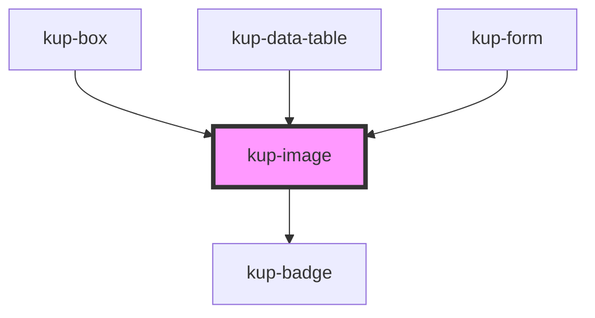

# kup-image

<!-- Auto Generated Below -->

## Properties

| Property             | Attribute               | Description                                                                                                                                                               | Type      | Default                   |
| -------------------- | ----------------------- | ------------------------------------------------------------------------------------------------------------------------------------------------------------------------- | --------- | ------------------------- |
| `alt`                | `alt`                   |                                                                                                                                                                           | `string`  | `''`                      |
| `badges`             | --                      |                                                                                                                                                                           | `Badge[]` | `undefined`               |
| `height`             | `height`                |                                                                                                                                                                           | `string`  | `KupImage.DEFAULT_HEIGHT` |
| `limitWidthByHeight` | `limit-width-by-height` | When the image width should be decided by limiting its height. This leverages the browser default image handling mechanism. Have a look at the CSS part for more details. | `boolean` | `false`                   |
| `maxHeight`          | `max-height`            |                                                                                                                                                                           | `string`  | `''`                      |
| `maxWidth`           | `max-width`             |                                                                                                                                                                           | `string`  | `''`                      |
| `src`                | `src`                   |                                                                                                                                                                           | `string`  | `''`                      |
| `width`              | `width`                 |                                                                                                                                                                           | `string`  | `KupImage.DEFAULT_WIDTH`  |

## Dependencies

### Used by

 - [kup-box](../kup-box)
 - [kup-data-table](../kup-data-table)
 - [kup-form](../kup-form)

### Depends on

- [kup-badge](../kup-badge)

### Graph

----------------------------------------------

*Built with [StencilJS](https://stenciljs.com/)*
