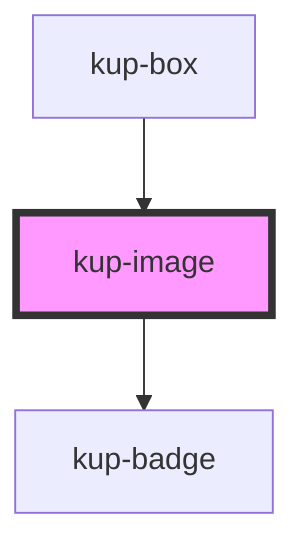

# kup-image

<!-- Auto Generated Below -->

## Properties

| Property    | Attribute    | Description | Type      | Default                   |
| ----------- | ------------ | ----------- | --------- | ------------------------- |
| `alt`       | `alt`        |             | `string`  | `''`                      |
| `badges`    | --           |             | `Badge[]` | `undefined`               |
| `height`    | `height`     |             | `string`  | `KupImage.DEFAULT_HEIGHT` |
| `maxHeight` | `max-height` |             | `string`  | `''`                      |
| `maxWidth`  | `max-width`  |             | `string`  | `''`                      |
| `src`       | `src`        |             | `string`  | `''`                      |
| `width`     | `width`      |             | `string`  | `KupImage.DEFAULT_WIDTH`  |

## Dependencies

### Used by

 - [kup-box](../kup-box)

### Depends on

- [kup-badge](../kup-badge)

### Graph

----------------------------------------------

*Built with [StencilJS](https://stenciljs.com/)*
