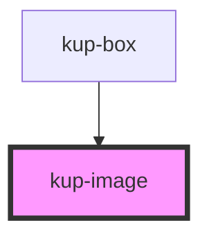

# kup-image

<!-- Auto Generated Below -->

## Properties

| Property | Attribute | Description | Type      | Default     |
| -------- | --------- | ----------- | --------- | ----------- |
| `alt`    | `alt`     |             | `string`  | `''`        |
| `badges` | --        |             | `Badge[]` | `undefined` |
| `height` | `height`  |             | `number`  | `64`        |
| `src`    | `src`     |             | `string`  | `''`        |
| `width`  | `width`   |             | `number`  | `64`        |

## CSS Custom Properties

| Name                                                               | Description            |
| ------------------------------------------------------------------ | ---------------------- |
| `--int_badge-background-color, --kup-image_badge-background-color` | badge background color |
| `--int_badge-color, --kup-image_badge-color`                       | badge text color       |

## Dependencies

### Used by

 - [kup-box](..\kup-box)

### Graph

----------------------------------------------

*Built with [StencilJS](https://stenciljs.com/)*
