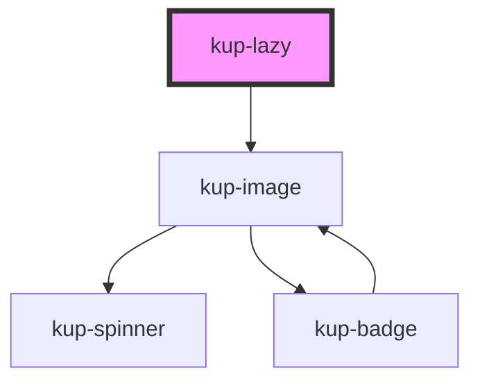

# kup-lazy

<!-- Auto Generated Below -->

## Properties

| Property          | Attribute          | Description                                                                                                     | Type      | Default     |
| ----------------- | ------------------ | --------------------------------------------------------------------------------------------------------------- | --------- | ----------- |
| `componentName`   | `component-name`   | Sets the tag name of the component to be lazy loaded.                                                           | `string`  | `undefined` |
| `customStyle`     | `custom-style`     | Custom style of the component. For more information: https://ketchup.smeup.com/ketchup-showcase/#/customization | `string`  | `undefined` |
| `data`            | --                 | Sets the data of the component to be lazy loaded.                                                               | `{}`      | `undefined` |
| `showPlaceholder` | `show-placeholder` | Displays an animated SVG placeholder until the component is loaded.                                             | `boolean` | `true`      |

## Methods

### `refreshCustomStyle(customStyleTheme: string) => Promise<void>`

#### Returns

Type: `Promise<void>`

## Dependencies

### Depends on

- [kup-image](../kup-image)

### Graph

----------------------------------------------

*Built with [StencilJS](https://stenciljs.com/)*
