# kup-list

<!-- Auto Generated Below -->

## Properties

| Property             | Attribute             | Description                                                                      | Type                                                                                                                                                                | Default                        |
| -------------------- | --------------------- | -------------------------------------------------------------------------------- | ------------------------------------------------------------------------------------------------------------------------------------------------------------------- | ------------------------------ |
| `customStyle`        | `custom-style`        | Custom style of the component.                                                   | `string`                                                                                                                                                            | `''`                           |
| `data`               | --                    | The data of the list.                                                            | `KupListNode[]`                                                                                                                                                     | `[]`                           |
| `displayMode`        | `display-mode`        | Selects how the items must display their label and how they can be filtered for. | `ItemsDisplayMode.CODE \| ItemsDisplayMode.CODE_AND_DESC \| ItemsDisplayMode.CODE_AND_DESC_ALIAS \| ItemsDisplayMode.DESCRIPTION \| ItemsDisplayMode.DESC_AND_CODE` | `ItemsDisplayMode.DESCRIPTION` |
| `filter`             | `filter`              | Keeps string for filtering elements when filter mode is active                   | `string`                                                                                                                                                            | `''`                           |
| `hideText`           | `hide-text`           | Hides rows' text, ideally to display a list of icons only.                       | `boolean`                                                                                                                                                           | `false`                        |
| `isMenu`             | `is-menu`             | Defines whether the list is a menu or not.                                       | `boolean`                                                                                                                                                           | `false`                        |
| `keyboardNavigation` | `keyboard-navigation` | When true, enables items' navigation through arrow keys.                         | `boolean`                                                                                                                                                           | `true`                         |
| `menuVisible`        | `menu-visible`        | Sets the status of the menu, when false it's hidden otherwise it's visible.      | `boolean`                                                                                                                                                           | `false`                        |
| `roleType`           | `role-type`           | Defines the type of selection. Values accepted: listbox, radiogroup or group.    | `KupListRole.GROUP \| KupListRole.LISTBOX \| KupListRole.RADIOGROUP`                                                                                                | `KupListRole.LISTBOX`          |
| `selectable`         | `selectable`          | Defines whether items are selectable or not.                                     | `boolean`                                                                                                                                                           | `true`                         |
| `showFilter`         | `show-filter`         | Show filter for filter elements in list                                          | `boolean`                                                                                                                                                           | `false`                        |
| `showIcons`          | `show-icons`          | Displays the icons associated to each row when set to true.                      | `boolean`                                                                                                                                                           | `false`                        |
| `twoLine`            | `two-line`            | The list elements descriptions will be arranged in two lines.                    | `boolean`                                                                                                                                                           | `false`                        |

## Events

| Event            | Description | Type                               |
| ---------------- | ----------- | ---------------------------------- |
| `kup-list-blur`  |             | `CustomEvent<KupEventPayload>`     |
| `kup-list-click` |             | `CustomEvent<KupListEventPayload>` |
| `kup-list-focus` |             | `CustomEvent<KupEventPayload>`     |

## Methods

### `focusNext() => Promise<void>`

Focuses the next element of the list.

#### Returns

Type: `Promise<void>`

### `focusPrevious() => Promise<void>`

Focuses the previous element of the list.

#### Returns

Type: `Promise<void>`

### `getProps(descriptions?: boolean) => Promise<GenericObject>`

Used to retrieve component's props values.

#### Parameters

| Name           | Type      | Description                                                                            |
| -------------- | --------- | -------------------------------------------------------------------------------------- |
| `descriptions` | `boolean` | - When provided and true, the result will be the list of props with their description. |

#### Returns

Type: `Promise<GenericObject>`

List of props as object, each key will be a prop.

### `getSelectedNode() => Promise<KupListNode[]>`

Returns the selected node.

#### Returns

Type: `Promise<KupListNode[]>`

Selected node.

### `refresh() => Promise<void>`

This method is used to trigger a new render of the component.

#### Returns

Type: `Promise<void>`

### `select(index?: number) => Promise<void>`

Calls handleSelection internal method to select the given item.

#### Parameters

| Name    | Type     | Description                                                                                                                  |
| ------- | -------- | ---------------------------------------------------------------------------------------------------------------------------- |
| `index` | `number` | - Based zero index of the item that must be selected, when not provided the list will attempt to select the focused element. |

#### Returns

Type: `Promise<void>`

### `setBlur() => Promise<void>`

#### Returns

Type: `Promise<void>`

### `setFocus() => Promise<void>`

#### Returns

Type: `Promise<void>`

### `setFocusOnFirstEl() => Promise<void>`

Focuses the first element of the list.

#### Returns

Type: `Promise<void>`

### `setProps(props: GenericObject) => Promise<void>`

Sets the props to the component.

#### Parameters

| Name    | Type            | Description                                                  |
| ------- | --------------- | ------------------------------------------------------------ |
| `props` | `GenericObject` | - Object containing props that will be set to the component. |

#### Returns

Type: `Promise<void>`

## CSS Custom Properties

| Name                            | Description                                                                       |
| ------------------------------- | --------------------------------------------------------------------------------- |
| `--kup-list-background`         | Sets background of the list.                                                      |
| `--kup-list-color`              | Sets text color of the list.                                                      |
| `--kup-list-font-family`        | Sets font family of the component.                                                |
| `--kup-list-font-size`          | Sets font size of the component.                                                  |
| `--kup-list-font-weight`        | Sets font weight of the component.                                                |
| `--kup-list-group-item-height`  | Sets height of each list item when the list contains radio buttons or checkboxes. |
| `--kup-list-item-height`        | Sets height of each list item.                                                    |
| `--kup-list-item-padding-left`  | Sets left padding of each list item.                                              |
| `--kup-list-item-padding-right` | Sets right padding of each list item.                                             |
| `--kup-list-max-height-as-menu` | Sets max height when list is menu.                                                |
| `--kup-list-primary-color`      | Sets the primary color of the component.                                          |
| `--kup-list-primary-color-rgb`  | Sets the RGB values of the primary color of the component (used for shaders).     |
| `--kup-list-separator-color`    | Sets the color of separators.                                                     |
| `--kup-list-transition`         | Transitions duration for text and background colors.                              |

## Dependencies

### Used by

 - [kup-accordion](../kup-accordion)
 - [kup-autocomplete](../kup-autocomplete)
 - [kup-card](../kup-card)
 - [kup-combobox](../kup-combobox)
 - [kup-data-table](../kup-data-table)
 - [kup-dropdown-button](../kup-dropdown-button)
 - [kup-list](.)
 - [kup-tab-bar](../kup-tab-bar)
 - [kup-time-picker](../kup-time-picker)
 - [kup-tree](../kup-tree)
 - [kup-typography](../kup-typography)

### Depends on

- [kup-list](.)
- [kup-radio](../kup-radio)
- [kup-card](../kup-card)
- [kup-dialog](../kup-dialog)
- [kup-badge](../kup-badge)

### Graph

```mermaid
graph TD;
  kup-list --> kup-list
  kup-radio --> kup-card
  kup-radio --> kup-dialog
  kup-radio --> kup-badge
  kup-card --> kup-list
  kup-image --> kup-card
  kup-image --> kup-image
  kup-image --> kup-dialog
  kup-image --> kup-spinner
  kup-image --> kup-badge
  kup-dialog --> kup-badge
  kup-dialog --> kup-card
  kup-dialog --> kup-dialog
  kup-badge --> kup-badge
  kup-badge --> kup-card
  kup-badge --> kup-dialog
  kup-spinner --> kup-card
  kup-spinner --> kup-dialog
  kup-autocomplete --> kup-list
  kup-chip --> kup-card
  kup-chip --> kup-dialog
  kup-chip --> kup-badge
  kup-text-field --> kup-badge
  kup-text-field --> kup-card
  kup-text-field --> kup-dialog
  kup-color-picker --> kup-card
  kup-color-picker --> kup-dialog
  kup-color-picker --> kup-badge
  kup-combobox --> kup-list
  kup-date-picker --> kup-card
  kup-date-picker --> kup-badge
  kup-date-picker --> kup-dialog
  kup-file-upload --> kup-spinner
  kup-file-upload --> kup-card
  kup-file-upload --> kup-dialog
  kup-file-upload --> kup-badge
  kup-rating --> kup-card
  kup-rating --> kup-dialog
  kup-time-picker --> kup-list
  kup-image-list --> kup-card
  kup-image-list --> kup-dialog
  kup-image-list --> kup-badge
  kup-image-list --> kup-image
  kup-image-list --> kup-autocomplete
  kup-image-list --> kup-chip
  kup-image-list --> kup-text-field
  kup-image-list --> kup-color-picker
  kup-image-list --> kup-combobox
  kup-image-list --> kup-date-picker
  kup-image-list --> kup-file-upload
  kup-image-list --> kup-rating
  kup-image-list --> kup-time-picker
  kup-image-list --> kup-image-list
  kup-image-list --> kup-button-list
  kup-image-list --> kup-chart
  kup-image-list --> kup-gauge
  kup-image-list --> kup-progress-bar
  kup-image-list --> kup-toolbar
  kup-button-list --> kup-dropdown-button
  kup-button-list --> kup-card
  kup-button-list --> kup-dialog
  kup-button-list --> kup-badge
  kup-dropdown-button --> kup-list
  kup-chart --> kup-card
  kup-chart --> kup-dialog
  kup-gauge --> kup-card
  kup-gauge --> kup-dialog
  kup-progress-bar --> kup-card
  kup-progress-bar --> kup-dialog
  kup-toolbar --> kup-card
  kup-toolbar --> kup-dialog
  kup-toolbar --> kup-badge
  kup-toolbar --> kup-image
  kup-toolbar --> kup-autocomplete
  kup-toolbar --> kup-chip
  kup-toolbar --> kup-text-field
  kup-toolbar --> kup-color-picker
  kup-toolbar --> kup-combobox
  kup-toolbar --> kup-date-picker
  kup-toolbar --> kup-file-upload
  kup-toolbar --> kup-rating
  kup-toolbar --> kup-time-picker
  kup-toolbar --> kup-image-list
  kup-toolbar --> kup-button-list
  kup-toolbar --> kup-chart
  kup-toolbar --> kup-gauge
  kup-toolbar --> kup-progress-bar
  kup-toolbar --> kup-toolbar
  kup-button --> kup-card
  kup-button --> kup-dialog
  kup-button --> kup-badge
  kup-checkbox --> kup-card
  kup-checkbox --> kup-dialog
  kup-checkbox --> kup-badge
  kup-data-table --> kup-list
  kup-switch --> kup-card
  kup-switch --> kup-dialog
  kup-form --> kup-card
  kup-form --> kup-dialog
  kup-form --> kup-image
  kup-form --> kup-autocomplete
  kup-form --> kup-chip
  kup-form --> kup-text-field
  kup-form --> kup-color-picker
  kup-form --> kup-combobox
  kup-form --> kup-date-picker
  kup-form --> kup-file-upload
  kup-form --> kup-rating
  kup-form --> kup-time-picker
  kup-form --> kup-image-list
  kup-form --> kup-button-list
  kup-form --> kup-chart
  kup-form --> kup-gauge
  kup-form --> kup-progress-bar
  kup-form --> kup-badge
  kup-form --> kup-toolbar
  kup-tree --> kup-list
  kup-tab-bar --> kup-list
  kup-accordion --> kup-list
  kup-typography --> kup-list
  style kup-list fill:#f9f,stroke:#333,stroke-width:4px
```

----------------------------------------------

*Built with [StencilJS](https://stenciljs.com/)*
