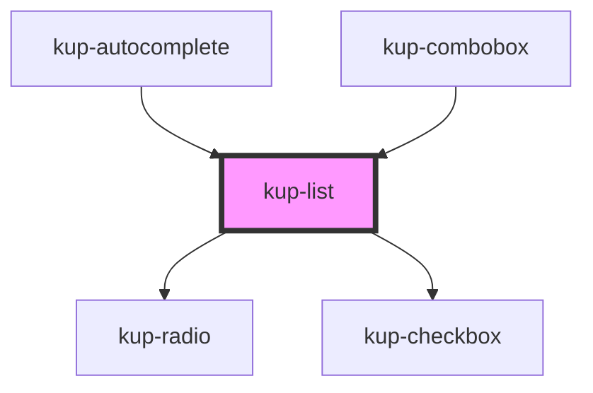

# kup-list

<!-- Auto Generated Below -->

## Properties

| Property      | Attribute      | Description                                                                     | Type                                                                                             | Default                        |
| ------------- | -------------- | ------------------------------------------------------------------------------- | ------------------------------------------------------------------------------------------------ | ------------------------------ |
| `customStyle` | `custom-style` | Custom style to be passed to the component.                                     | `string`                                                                                         | `undefined`                    |
| `data`        | --             | The data of the list.                                                           | `ComponentListElement[]`                                                                         | `[]`                           |
| `displayMode` | `display-mode` | Selects how the items must display their label and how they can be filtered for | `ItemsDisplayMode.CODE \| ItemsDisplayMode.DESCRIPTION \| ItemsDisplayMode.DESCRIPTION_AND_CODE` | `ItemsDisplayMode.DESCRIPTION` |
| `fieldId`     | `field-id`     | Identify the component.                                                         | `string`                                                                                         | `'list-id'`                    |
| `filter`      | `filter`       | Keeps string for filtering elements when filter mode is active                  | `string`                                                                                         | `''`                           |
| `isMenu`      | `is-menu`      | Defines whether the list is a menu or not.                                      | `boolean`                                                                                        | `false`                        |
| `menuVisible` | `menu-visible` | Sets the status of the menu, when false it's hidden otherwise it's visible.     | `boolean`                                                                                        | `false`                        |
| `roleType`    | `role-type`    | Defines the type of selection. Values accepted: listbox, radiogroup or group.   | `string`                                                                                         | `KupList.ROLE_LISTBOX`         |
| `selectable`  | `selectable`   | Defines if the list items ar or not selectable.                                 | `boolean`                                                                                        | `true`                         |
| `twoLine`     | `two-line`     | The list elements descriptions will be arranged in two lines.                   | `boolean`                                                                                        | `false`                        |

## Events

| Event           | Description | Type                                                                |
| --------------- | ----------- | ------------------------------------------------------------------- |
| `kupListBlur`   | Events.     | `CustomEvent<{ selected: ComponentListElement; el: EventTarget; }>` |
| `kupListChange` |             | `CustomEvent<{ selected: ComponentListElement; el: EventTarget; }>` |
| `kupListClick`  |             | `CustomEvent<{ selected: ComponentListElement; el: EventTarget; }>` |
| `kupListFocus`  |             | `CustomEvent<{ selected: ComponentListElement; el: EventTarget; }>` |
| `kupListInput`  |             | `CustomEvent<{ selected: ComponentListElement; el: EventTarget; }>` |

## Dependencies

### Used by

 - [kup-autocomplete](../kup-autocomplete)
 - [kup-combobox](../kup-combobox)

### Depends on

- [kup-radio](../kup-radio)
- [kup-checkbox](../kup-checkbox)

### Graph

----------------------------------------------

*Built with [StencilJS](https://stenciljs.com/)*
