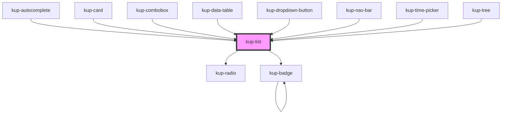

# kup-list

<!-- Auto Generated Below -->

## Properties

| Property             | Attribute             | Description                                                                                                           | Type                                                                                             | Default                        |
| -------------------- | --------------------- | --------------------------------------------------------------------------------------------------------------------- | ------------------------------------------------------------------------------------------------ | ------------------------------ |
| `customStyle`        | `custom-style`        | Custom style of the component.                                                                                        | `string`                                                                                         | `''`                           |
| `data`               | --                    | The data of the list.                                                                                                 | `KupListData[]`                                                                                  | `[]`                           |
| `displayMode`        | `display-mode`        | Selects how the items must display their label and how they can be filtered for.                                      | `ItemsDisplayMode.CODE \| ItemsDisplayMode.DESCRIPTION \| ItemsDisplayMode.DESCRIPTION_AND_CODE` | `ItemsDisplayMode.DESCRIPTION` |
| `filter`             | `filter`              | Keeps string for filtering elements when filter mode is active                                                        | `string`                                                                                         | `''`                           |
| `hideText`           | `hide-text`           | Hides rows' text, ideally to display a list of icons only.                                                            | `boolean`                                                                                        | `false`                        |
| `isMenu`             | `is-menu`             | Defines whether the list is a menu or not.                                                                            | `boolean`                                                                                        | `false`                        |
| `keyboardNavigation` | `keyboard-navigation` | When true, enables items' navigation through keys. Defaults to false when the component's isMenu prop is set to true. | `boolean`                                                                                        | `undefined`                    |
| `menuVisible`        | `menu-visible`        | Sets the status of the menu, when false it's hidden otherwise it's visible.                                           | `boolean`                                                                                        | `false`                        |
| `roleType`           | `role-type`           | Defines the type of selection. Values accepted: listbox, radiogroup or group.                                         | `KupListRole.GROUP \| KupListRole.LISTBOX \| KupListRole.RADIOGROUP`                             | `KupListRole.LISTBOX`          |
| `selectable`         | `selectable`          | Defines whether items are selectable or not.                                                                          | `boolean`                                                                                        | `true`                         |
| `showIcons`          | `show-icons`          | Displays the icons associated to each row when set to true.                                                           | `boolean`                                                                                        | `false`                        |
| `twoLine`            | `two-line`            | The list elements descriptions will be arranged in two lines.                                                         | `boolean`                                                                                        | `false`                        |

## Events

| Event            | Description | Type                               |
| ---------------- | ----------- | ---------------------------------- |
| `kup-list-blur`  |             | `CustomEvent<KupEventPayload>`     |
| `kup-list-click` |             | `CustomEvent<KupListEventPayload>` |
| `kup-list-focus` |             | `CustomEvent<KupEventPayload>`     |

## Methods

### `focusNext() => Promise<void>`

Focuses the next element of the list.

#### Returns

Type: `Promise<void>`

### `focusPrevious() => Promise<void>`

Focuses the previous element of the list.

#### Returns

Type: `Promise<void>`

### `getProps(descriptions?: boolean) => Promise<GenericObject>`

Used to retrieve component's props values.

#### Returns

Type: `Promise<GenericObject>`

### `refresh() => Promise<void>`

This method is used to trigger a new render of the component.

#### Returns

Type: `Promise<void>`

### `resetFilter(newFilter: string) => Promise<void>`

Resets filter.

#### Returns

Type: `Promise<void>`

### `select(index?: number) => Promise<void>`

Calls handleSelection internal method to select the given item.

#### Returns

Type: `Promise<void>`

### `setProps(props: GenericObject) => Promise<void>`

Sets the props to the component.

#### Returns

Type: `Promise<void>`

## Dependencies

### Used by

 - [kup-autocomplete](../kup-autocomplete)
 - [kup-card](../kup-card)
 - [kup-combobox](../kup-combobox)
 - [kup-data-table](../kup-data-table)
 - [kup-dropdown-button](../kup-dropdown-button)
 - [kup-nav-bar](../kup-nav-bar)
 - [kup-time-picker](../kup-time-picker)
 - [kup-tree](../kup-tree)

### Depends on

- [kup-radio](../kup-radio)
- [kup-badge](../kup-badge)

### Graph

----------------------------------------------

*Built with [StencilJS](https://stenciljs.com/)*
