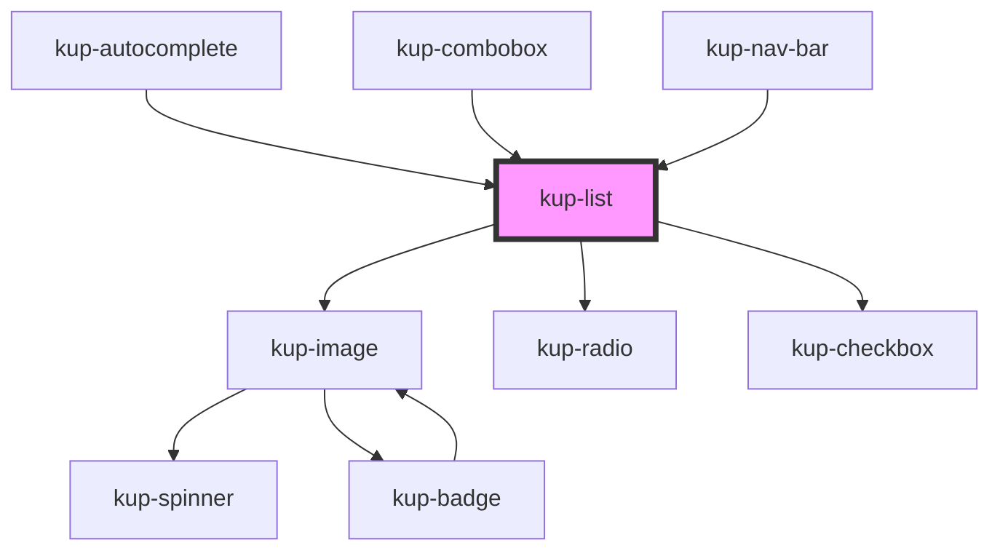

# kup-list

<!-- Auto Generated Below -->

## Properties

| Property      | Attribute      | Description                                                                                                     | Type                                                                                             | Default                        |
| ------------- | -------------- | --------------------------------------------------------------------------------------------------------------- | ------------------------------------------------------------------------------------------------ | ------------------------------ |
| `arrowDown`   | `arrow-down`   | Used to navigate the list when it's bound to a text field, i.e.: autocomplete.                                  | `boolean`                                                                                        | `false`                        |
| `arrowUp`     | `arrow-up`     |                                                                                                                 | `boolean`                                                                                        | `false`                        |
| `customStyle` | `custom-style` | Custom style of the component. For more information: https://ketchup.smeup.com/ketchup-showcase/#/customization | `string`                                                                                         | `undefined`                    |
| `data`        | --             | The data of the list.                                                                                           | `ComponentListElement[]`                                                                         | `[]`                           |
| `displayMode` | `display-mode` | Selects how the items must display their label and how they can be filtered for.                                | `ItemsDisplayMode.CODE \| ItemsDisplayMode.DESCRIPTION \| ItemsDisplayMode.DESCRIPTION_AND_CODE` | `ItemsDisplayMode.DESCRIPTION` |
| `filter`      | `filter`       | Keeps string for filtering elements when filter mode is active                                                  | `string`                                                                                         | `''`                           |
| `hideText`    | `hide-text`    | Hides rows' text, ideally to display a list of icons only.                                                      | `boolean`                                                                                        | `false`                        |
| `isMenu`      | `is-menu`      | Defines whether the list is a menu or not.                                                                      | `boolean`                                                                                        | `false`                        |
| `menuVisible` | `menu-visible` | Sets the status of the menu, when false it's hidden otherwise it's visible.                                     | `boolean`                                                                                        | `false`                        |
| `roleType`    | `role-type`    | Defines the type of selection. Values accepted: listbox, radiogroup or group.                                   | `string`                                                                                         | `KupList.ROLE_LISTBOX`         |
| `selectable`  | `selectable`   | Defines whether items are selectable or not.                                                                    | `boolean`                                                                                        | `true`                         |
| `showIcons`   | `show-icons`   | Displays the icons associated to each row when set to true.                                                     | `boolean`                                                                                        | `false`                        |
| `twoLine`     | `two-line`     | The list elements descriptions will be arranged in two lines.                                                   | `boolean`                                                                                        | `false`                        |

## Events

| Event           | Description | Type                                                                |
| --------------- | ----------- | ------------------------------------------------------------------- |
| `kupListBlur`   | Events.     | `CustomEvent<{ selected: ComponentListElement; el: EventTarget; }>` |
| `kupListChange` |             | `CustomEvent<{ selected: ComponentListElement; el: EventTarget; }>` |
| `kupListClick`  |             | `CustomEvent<{ selected: ComponentListElement; el: EventTarget; }>` |
| `kupListFocus`  |             | `CustomEvent<{ selected: ComponentListElement; el: EventTarget; }>` |
| `kupListInput`  |             | `CustomEvent<{ selected: ComponentListElement; el: EventTarget; }>` |

## Methods

### `refreshCustomStyle(customStyleTheme: string) => Promise<void>`

#### Returns

Type: `Promise<void>`

### `resetFilter(newFilter: string) => Promise<void>`

#### Returns

Type: `Promise<void>`

## Dependencies

### Used by

 - [kup-autocomplete](../kup-autocomplete)
 - [kup-combobox](../kup-combobox)
 - [kup-nav-bar](../kup-nav-bar)

### Depends on

- [kup-image](../kup-image)
- [kup-radio](../kup-radio)
- [kup-checkbox](../kup-checkbox)

### Graph

----------------------------------------------

*Built with [StencilJS](https://stenciljs.com/)*
