# kup-magic-box

<!-- Auto Generated Below -->

## Properties

| Property      | Attribute      | Description                                                      | Type             | Default |
| ------------- | -------------- | ---------------------------------------------------------------- | ---------------- | ------- |
| `customStyle` | `custom-style` | Custom style of the component.                                   | `string`         | `''`    |
| `data`        | --             | Sets the data that will be used to display different components. | `KupDataDataset` | `null`  |

## Methods

### `getProps(descriptions?: boolean) => Promise<GenericObject>`

Used to retrieve component's props values.

#### Returns

Type: `Promise<GenericObject>`

List of props as object, each key will be a prop.

### `refresh() => Promise<void>`

This method is used to trigger a new render of the component.

#### Returns

Type: `Promise<void>`

### `setProps(props: GenericObject) => Promise<void>`

Sets the props to the component.

#### Returns

Type: `Promise<void>`

## Dependencies

### Depends on

- [kup-text-field](../kup-text-field)
- [kup-box](../kup-box)
- [kup-button-list](../kup-button-list)
- [kup-chip](../kup-chip)
- [kup-chart](../kup-chart)
- [kup-echart](../kup-echart)
- [kup-data-table](../kup-data-table)
- [kup-tree](../kup-tree)
- [kup-combobox](../kup-combobox)
- [kup-button](../kup-button)
- [kup-card](../kup-card)
- [kup-badge](../kup-badge)

### Graph

```mermaid
graph TD;
  kup-magic-box --> kup-text-field
  kup-magic-box --> kup-box
  kup-magic-box --> kup-button-list
  kup-magic-box --> kup-chip
  kup-magic-box --> kup-chart
  kup-magic-box --> kup-echart
  kup-magic-box --> kup-data-table
  kup-magic-box --> kup-tree
  kup-magic-box --> kup-combobox
  kup-magic-box --> kup-button
  kup-magic-box --> kup-card
  kup-magic-box --> kup-badge
  kup-text-field --> kup-card
  kup-card --> kup-autocomplete
  kup-card --> kup-color-picker
  kup-card --> kup-combobox
  kup-card --> kup-date-picker
  kup-card --> kup-rating
  kup-card --> kup-time-picker
  kup-card --> kup-image
  kup-card --> kup-button
  kup-card --> kup-button-list
  kup-card --> kup-chart
  kup-card --> kup-gauge
  kup-card --> kup-progress-bar
  kup-card --> kup-radio
  kup-card --> kup-badge
  kup-card --> kup-chip
  kup-card --> kup-list
  kup-card --> kup-form
  kup-card --> kup-checkbox
  kup-card --> kup-text-field
  kup-card --> kup-data-table
  kup-card --> kup-spinner
  kup-card --> kup-tab-bar
  kup-card --> kup-tree
  kup-card --> kup-switch
  kup-card --> kup-dropdown-button
  kup-card --> kup-card
  kup-autocomplete --> kup-list
  kup-autocomplete --> kup-card
  kup-list --> kup-list
  kup-list --> kup-radio
  kup-list --> kup-card
  kup-list --> kup-badge
  kup-radio --> kup-card
  kup-badge --> kup-badge
  kup-badge --> kup-card
  kup-color-picker --> kup-card
  kup-combobox --> kup-list
  kup-combobox --> kup-card
  kup-date-picker --> kup-card
  kup-rating --> kup-card
  kup-time-picker --> kup-card
  kup-time-picker --> kup-list
  kup-image --> kup-spinner
  kup-image --> kup-card
  kup-image --> kup-badge
  kup-spinner --> kup-card
  kup-button --> kup-card
  kup-button --> kup-badge
  kup-button-list --> kup-dropdown-button
  kup-button-list --> kup-card
  kup-button-list --> kup-badge
  kup-dropdown-button --> kup-list
  kup-dropdown-button --> kup-card
  kup-dropdown-button --> kup-badge
  kup-chart --> kup-card
  kup-gauge --> kup-card
  kup-progress-bar --> kup-card
  kup-chip --> kup-card
  kup-chip --> kup-badge
  kup-form --> kup-card
  kup-form --> kup-autocomplete
  kup-form --> kup-color-picker
  kup-form --> kup-combobox
  kup-form --> kup-date-picker
  kup-form --> kup-rating
  kup-form --> kup-time-picker
  kup-form --> kup-image
  kup-form --> kup-button
  kup-form --> kup-button-list
  kup-form --> kup-chart
  kup-form --> kup-gauge
  kup-form --> kup-progress-bar
  kup-form --> kup-radio
  kup-form --> kup-badge
  kup-checkbox --> kup-card
  kup-data-table --> kup-card
  kup-data-table --> kup-list
  kup-data-table --> kup-switch
  kup-data-table --> kup-button
  kup-data-table --> kup-spinner
  kup-data-table --> kup-form
  kup-data-table --> kup-image
  kup-data-table --> kup-checkbox
  kup-data-table --> kup-combobox
  kup-data-table --> kup-badge
  kup-data-table --> kup-autocomplete
  kup-data-table --> kup-color-picker
  kup-data-table --> kup-date-picker
  kup-data-table --> kup-rating
  kup-data-table --> kup-time-picker
  kup-data-table --> kup-button-list
  kup-data-table --> kup-chart
  kup-data-table --> kup-gauge
  kup-data-table --> kup-progress-bar
  kup-data-table --> kup-radio
  kup-switch --> kup-card
  kup-tab-bar --> kup-card
  kup-tab-bar --> kup-badge
  kup-tree --> kup-card
  kup-tree --> kup-list
  kup-tree --> kup-text-field
  kup-tree --> kup-autocomplete
  kup-tree --> kup-color-picker
  kup-tree --> kup-combobox
  kup-tree --> kup-date-picker
  kup-tree --> kup-rating
  kup-tree --> kup-time-picker
  kup-tree --> kup-image
  kup-tree --> kup-button
  kup-tree --> kup-button-list
  kup-tree --> kup-chart
  kup-tree --> kup-gauge
  kup-tree --> kup-progress-bar
  kup-tree --> kup-radio
  kup-tree --> kup-badge
  kup-box --> kup-card
  kup-box --> kup-checkbox
  kup-box --> kup-badge
  kup-box --> kup-combobox
  kup-box --> kup-text-field
  kup-box --> kup-autocomplete
  kup-box --> kup-color-picker
  kup-box --> kup-date-picker
  kup-box --> kup-rating
  kup-box --> kup-time-picker
  kup-box --> kup-image
  kup-box --> kup-button
  kup-box --> kup-button-list
  kup-box --> kup-chart
  kup-box --> kup-gauge
  kup-box --> kup-progress-bar
  kup-box --> kup-radio
  kup-echart --> kup-card
  style kup-magic-box fill:#f9f,stroke:#333,stroke-width:4px
```

----------------------------------------------

*Built with [StencilJS](https://stenciljs.com/)*
