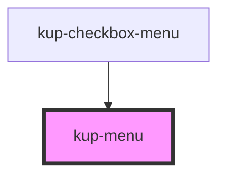

# kup-menu

<!-- Auto Generated Below -->

## Properties

| Property                 | Attribute              | Description                                                                                                                                                                                                                                                                                                                                                                                                                                                   | Type          | Default |
| ------------------------ | ---------------------- | ------------------------------------------------------------------------------------------------------------------------------------------------------------------------------------------------------------------------------------------------------------------------------------------------------------------------------------------------------------------------------------------------------------------------------------------------------------- | ------------- | ------- |
| `closeOnOuterClick`      | `close-on-outer-click` | When set to true, the menu will automatically close when the user clicks outside of its deactivationRelativeTo prop.                                                                                                                                                                                                                                                                                                                                          | `boolean`     | `true`  |
| `deactivationRelativeTo` | --                     | When closeOnOuterClick is set to true, the menu will search for this element inside the event path: if found, then the menu will not be closed. Therefore, if the menu closing event comes from this element or one of its descendants, the menu will not be closed. If left to null, the component will automatically use the element provided by positionRelativeTo prop. If positionRelativeTo is not defined, it will default to the menu parent element. | `HTMLElement` | `null`  |
| `isActive`               | `is-active`            | Open or closes the menu. The menu itself can edit this prop.                                                                                                                                                                                                                                                                                                                                                                                                  | `boolean`     | `false` |
| `margin`                 | `margin`               | Specifies how many pixels will be use to separate the menu from its positionRelativeTo element.                                                                                                                                                                                                                                                                                                                                                               | `number`      | `0`     |
| `positionRelativeTo`     | --                     | The element relative to which the menu will be opened in a given position. If left to null, once, when the component menu is mounted, this prop will be automatically set to the parent HTML element.                                                                                                                                                                                                                                                         | `HTMLElement` | `null`  |

## Events

| Event          | Description                | Type                |
| -------------- | -------------------------- | ------------------- |
| `kupMenuClose` | When the menu gets closed. | `CustomEvent<void>` |

## Dependencies

### Used by

 - [kup-checkbox-menu](../kup-checkbox-menu)

### Graph

----------------------------------------------

*Built with [StencilJS](https://stenciljs.com/)*
