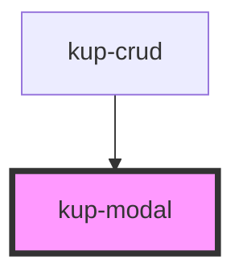

# kup-modal

<!-- Auto Generated Below -->

## Properties

| Property  | Attribute | Description | Type      | Default     |
| --------- | --------- | ----------- | --------- | ----------- |
| `title1`  | `title-1` |             | `string`  | `undefined` |
| `visible` | `visible` |             | `boolean` | `undefined` |

## Events

| Event            | Description | Type               |
| ---------------- | ----------- | ------------------ |
| `kupModalCancel` |             | `CustomEvent<any>` |

## Dependencies

### Used by

 - [kup-crud](../kup-crud)

### Graph

----------------------------------------------

*Built with [StencilJS](https://stenciljs.com/)*
