# kup-switch

<!-- Auto Generated Below -->

## Properties

| Property      | Attribute      | Description                                                                                                   | Type              | Default |
| ------------- | -------------- | ------------------------------------------------------------------------------------------------------------- | ----------------- | ------- |
| `customStyle` | `custom-style` |                                                                                                               | `string`          | `''`    |
| `data`        | --             | Contains the data used to populate the tree view and the data used to visualize selected nodes via kup-chips. | `MultiSelectData` | `null`  |
| `disabled`    | `disabled`     |                                                                                                               | `boolean`         | `false` |

## Methods

### `getProps(descriptions?: boolean) => Promise<GenericObject>`

#### Parameters

| Name           | Type      | Description |
| -------------- | --------- | ----------- |
| `descriptions` | `boolean` |             |

#### Returns

Type: `Promise<GenericObject>`

### `refresh() => Promise<void>`

#### Returns

Type: `Promise<void>`

### `setProps(props: GenericObject) => Promise<void>`

#### Parameters

| Name    | Type            | Description |
| ------- | --------------- | ----------- |
| `props` | `GenericObject` |             |

#### Returns

Type: `Promise<void>`

## CSS Custom Properties

| Name                                   | Description                                     |
| -------------------------------------- | ----------------------------------------------- |
| `--kup-multi-select-font-family`       | Sets font family of the multi-select's label.   |
| `--kup-multi-select-font-size`         | Sets font size of the multi-select's label.     |
| `--kup-multi-select-font-weight`       | Sets font weight of the multi-select's label.   |
| `--kup-multi-select-label-color`       | Sets text color of the multi-select's label.    |
| `--kup-multi-select-primary-color`     | Sets primary color of the component.            |
| `--kup-multi-select-primary-color-rgb` | Sets primary color RGB values of the component. |
| `--kup-multi-select-thumb-color`       | Sets thumb color.                               |

## Dependencies

### Used by

 - [kup-box](../kup-box)
 - [kup-card](../kup-card)
 - [kup-cell](../kup-cell)
 - [kup-data-table](../kup-data-table)
 - [kup-form](../kup-form)
 - [kup-image-list](../kup-image-list)
 - [kup-input-panel](../kup-input-panel)
 - [kup-toolbar](../kup-toolbar)
 - [kup-tree](../kup-tree)

### Depends on

- [kup-chip](../kup-chip)
- [kup-tree](../kup-tree)
- [kup-card](../kup-card)
- [kup-dialog](../kup-dialog)

### Graph

```mermaid
graph TD;
  kup-multi-select --> kup-chip
  kup-multi-select --> kup-tree
  kup-multi-select --> kup-card
  kup-multi-select --> kup-dialog
  kup-chip --> kup-card
  kup-chip --> kup-dialog
  kup-chip --> kup-badge
  kup-card --> kup-multi-select
  kup-image --> kup-card
  kup-image --> kup-image
  kup-image --> kup-dialog
  kup-image --> kup-spinner
  kup-image --> kup-badge
  kup-dialog --> kup-badge
  kup-dialog --> kup-card
  kup-dialog --> kup-dialog
  kup-badge --> kup-badge
  kup-badge --> kup-card
  kup-badge --> kup-dialog
  kup-spinner --> kup-card
  kup-spinner --> kup-dialog
  kup-autocomplete --> kup-list
  kup-autocomplete --> kup-card
  kup-autocomplete --> kup-dialog
  kup-autocomplete --> kup-badge
  kup-list --> kup-list
  kup-list --> kup-radio
  kup-list --> kup-card
  kup-list --> kup-dialog
  kup-list --> kup-badge
  kup-radio --> kup-card
  kup-radio --> kup-dialog
  kup-radio --> kup-badge
  kup-text-field --> kup-card
  kup-text-field --> kup-dialog
  kup-text-field --> kup-badge
  kup-color-picker --> kup-card
  kup-color-picker --> kup-dialog
  kup-color-picker --> kup-badge
  kup-combobox --> kup-list
  kup-combobox --> kup-card
  kup-combobox --> kup-dialog
  kup-combobox --> kup-badge
  kup-date-picker --> kup-card
  kup-date-picker --> kup-dialog
  kup-date-picker --> kup-badge
  kup-file-upload --> kup-spinner
  kup-file-upload --> kup-card
  kup-file-upload --> kup-dialog
  kup-file-upload --> kup-badge
  kup-rating --> kup-card
  kup-rating --> kup-dialog
  kup-time-picker --> kup-card
  kup-time-picker --> kup-list
  kup-time-picker --> kup-dialog
  kup-time-picker --> kup-badge
  kup-button-list --> kup-dropdown-button
  kup-button-list --> kup-card
  kup-button-list --> kup-dialog
  kup-button-list --> kup-badge
  kup-dropdown-button --> kup-list
  kup-dropdown-button --> kup-card
  kup-dropdown-button --> kup-dialog
  kup-dropdown-button --> kup-badge
  kup-chart --> kup-card
  kup-chart --> kup-dialog
  kup-gauge --> kup-card
  kup-gauge --> kup-dialog
  kup-progress-bar --> kup-card
  kup-progress-bar --> kup-dialog
  kup-toolbar --> kup-multi-select
  kup-button --> kup-card
  kup-button --> kup-dialog
  kup-button --> kup-badge
  kup-checkbox --> kup-card
  kup-checkbox --> kup-dialog
  kup-checkbox --> kup-badge
  kup-data-table --> kup-multi-select
  kup-switch --> kup-card
  kup-switch --> kup-dialog
  kup-form --> kup-multi-select
  kup-tab-bar --> kup-toolbar
  kup-tab-bar --> kup-card
  kup-tab-bar --> kup-dialog
  kup-tab-bar --> kup-badge
  kup-tree --> kup-multi-select
  kup-box --> kup-multi-select
  kup-cell --> kup-multi-select
  kup-image-list --> kup-multi-select
  kup-input-panel --> kup-multi-select
  style kup-multi-select fill:#f9f,stroke:#333,stroke-width:4px
```

----------------------------------------------

*Built with [StencilJS](https://stenciljs.com/)*
