# kup-switch

<!-- Auto Generated Below -->

## Properties

| Property | Attribute | Description | Type | Default |
| --- | --- | --- | --- | --- |
| `customStyle` | `custom-style` |  | `string` | `''` |
| `data` | -- | The json data used to populate the tree view: the basic, always visible tree nodes. | `KupTreeNode[]` | `[]` |
| `disabled` | `disabled` |  | `boolean` | `false` |

## Methods

### `getProps(descriptions?: boolean) => Promise<GenericObject>`

#### Parameters

| Name           | Type      | Description |
| -------------- | --------- | ----------- |
| `descriptions` | `boolean` |             |

#### Returns

Type: `Promise<GenericObject>`

### `refresh() => Promise<void>`

#### Returns

Type: `Promise<void>`

### `setProps(props: GenericObject) => Promise<void>`

#### Parameters

| Name    | Type            | Description |
| ------- | --------------- | ----------- |
| `props` | `GenericObject` |             |

#### Returns

Type: `Promise<void>`

## CSS Custom Properties

| Name | Description |
| --- | --- |
| `--kup-multi-select-font-family` | Sets font family of the multi-select's label. |
| `--kup-multi-select-font-size` | Sets font size of the multi-select's label. |
| `--kup-multi-select-font-weight` | Sets font weight of the multi-select's label. |
| `--kup-multi-select-label-color` | Sets text color of the multi-select's label. |
| `--kup-multi-select-primary-color` | Sets primary color of the component. |
| `--kup-multi-select-primary-color-rgb` | Sets primary color RGB values of the component. |
| `--kup-multi-select-thumb-color` | Sets thumb color. |

## Dependencies

### Depends on

-   [kup-chip](../kup-chip)
-   [kup-button](../kup-button)
-   [kup-tree](../kup-tree)
-   [kup-card](../kup-card)
-   [kup-dialog](../kup-dialog)

### Graph

```mermaid
graph TD;
  kup-multi-select --> kup-chip
  kup-multi-select --> kup-button
  kup-multi-select --> kup-tree
  kup-multi-select --> kup-card
  kup-multi-select --> kup-dialog
  kup-chip --> kup-card
  kup-chip --> kup-dialog
  kup-chip --> kup-badge
  kup-card --> kup-autocomplete
  kup-card --> kup-chip
  kup-card --> kup-text-field
  kup-card --> kup-color-picker
  kup-card --> kup-combobox
  kup-card --> kup-date-picker
  kup-card --> kup-rating
  kup-card --> kup-time-picker
  kup-card --> kup-image
  kup-card --> kup-button-list
  kup-card --> kup-chart
  kup-card --> kup-gauge
  kup-card --> kup-progress-bar
  kup-card --> kup-badge
  kup-card --> kup-toolbar
  kup-card --> kup-card
  kup-card --> kup-dialog
  kup-card --> kup-button
  kup-card --> kup-list
  kup-card --> kup-spinner
  kup-card --> kup-checkbox
  kup-card --> kup-data-table
  kup-card --> kup-tab-bar
  kup-card --> kup-tree
  kup-card --> kup-switch
  kup-card --> kup-dropdown-button
  kup-autocomplete --> kup-list
  kup-autocomplete --> kup-card
  kup-autocomplete --> kup-dialog
  kup-autocomplete --> kup-badge
  kup-list --> kup-list
  kup-list --> kup-radio
  kup-list --> kup-text-field
  kup-list --> kup-card
  kup-list --> kup-dialog
  kup-list --> kup-badge
  kup-radio --> kup-card
  kup-radio --> kup-dialog
  kup-radio --> kup-badge
  kup-dialog --> kup-badge
  kup-dialog --> kup-card
  kup-dialog --> kup-dialog
  kup-badge --> kup-badge
  kup-badge --> kup-card
  kup-badge --> kup-dialog
  kup-text-field --> kup-card
  kup-text-field --> kup-dialog
  kup-text-field --> kup-badge
  kup-color-picker --> kup-card
  kup-color-picker --> kup-dialog
  kup-color-picker --> kup-badge
  kup-combobox --> kup-list
  kup-combobox --> kup-card
  kup-combobox --> kup-dialog
  kup-combobox --> kup-badge
  kup-date-picker --> kup-card
  kup-date-picker --> kup-dialog
  kup-date-picker --> kup-badge
  kup-rating --> kup-card
  kup-rating --> kup-dialog
  kup-time-picker --> kup-card
  kup-time-picker --> kup-list
  kup-time-picker --> kup-dialog
  kup-time-picker --> kup-badge
  kup-image --> kup-card
  kup-image --> kup-image
  kup-image --> kup-dialog
  kup-image --> kup-spinner
  kup-image --> kup-badge
  kup-spinner --> kup-card
  kup-spinner --> kup-dialog
  kup-button-list --> kup-dropdown-button
  kup-button-list --> kup-card
  kup-button-list --> kup-dialog
  kup-button-list --> kup-badge
  kup-dropdown-button --> kup-list
  kup-dropdown-button --> kup-card
  kup-dropdown-button --> kup-dialog
  kup-dropdown-button --> kup-badge
  kup-chart --> kup-card
  kup-chart --> kup-dialog
  kup-gauge --> kup-card
  kup-gauge --> kup-dialog
  kup-progress-bar --> kup-card
  kup-progress-bar --> kup-dialog
  kup-toolbar --> kup-card
  kup-toolbar --> kup-dialog
  kup-toolbar --> kup-badge
  kup-toolbar --> kup-autocomplete
  kup-toolbar --> kup-chip
  kup-toolbar --> kup-text-field
  kup-toolbar --> kup-color-picker
  kup-toolbar --> kup-combobox
  kup-toolbar --> kup-date-picker
  kup-toolbar --> kup-rating
  kup-toolbar --> kup-time-picker
  kup-toolbar --> kup-image
  kup-toolbar --> kup-button-list
  kup-toolbar --> kup-chart
  kup-toolbar --> kup-gauge
  kup-toolbar --> kup-progress-bar
  kup-toolbar --> kup-toolbar
  kup-button --> kup-card
  kup-button --> kup-dialog
  kup-button --> kup-badge
  kup-checkbox --> kup-card
  kup-checkbox --> kup-dialog
  kup-checkbox --> kup-badge
  kup-data-table --> kup-card
  kup-data-table --> kup-list
  kup-data-table --> kup-switch
  kup-data-table --> kup-button
  kup-data-table --> kup-spinner
  kup-data-table --> kup-form
  kup-data-table --> kup-image
  kup-data-table --> kup-dialog
  kup-data-table --> kup-checkbox
  kup-data-table --> kup-combobox
  kup-data-table --> kup-dropdown-button
  kup-data-table --> kup-badge
  kup-data-table --> kup-autocomplete
  kup-data-table --> kup-chip
  kup-data-table --> kup-text-field
  kup-data-table --> kup-color-picker
  kup-data-table --> kup-date-picker
  kup-data-table --> kup-rating
  kup-data-table --> kup-time-picker
  kup-data-table --> kup-button-list
  kup-data-table --> kup-chart
  kup-data-table --> kup-gauge
  kup-data-table --> kup-progress-bar
  kup-data-table --> kup-toolbar
  kup-switch --> kup-card
  kup-switch --> kup-dialog
  kup-form --> kup-card
  kup-form --> kup-dialog
  kup-form --> kup-autocomplete
  kup-form --> kup-chip
  kup-form --> kup-text-field
  kup-form --> kup-color-picker
  kup-form --> kup-combobox
  kup-form --> kup-date-picker
  kup-form --> kup-rating
  kup-form --> kup-time-picker
  kup-form --> kup-image
  kup-form --> kup-button-list
  kup-form --> kup-chart
  kup-form --> kup-gauge
  kup-form --> kup-progress-bar
  kup-form --> kup-badge
  kup-form --> kup-toolbar
  kup-tab-bar --> kup-toolbar
  kup-tab-bar --> kup-card
  kup-tab-bar --> kup-dialog
  kup-tab-bar --> kup-badge
  kup-tree --> kup-card
  kup-tree --> kup-list
  kup-tree --> kup-text-field
  kup-tree --> kup-dialog
  kup-tree --> kup-autocomplete
  kup-tree --> kup-chip
  kup-tree --> kup-color-picker
  kup-tree --> kup-combobox
  kup-tree --> kup-date-picker
  kup-tree --> kup-rating
  kup-tree --> kup-time-picker
  kup-tree --> kup-image
  kup-tree --> kup-button-list
  kup-tree --> kup-chart
  kup-tree --> kup-gauge
  kup-tree --> kup-progress-bar
  kup-tree --> kup-badge
  kup-tree --> kup-toolbar
  style kup-multi-select fill:#f9f,stroke:#333,stroke-width:4px
```

---

_Built with [StencilJS](https://stenciljs.com/)_
