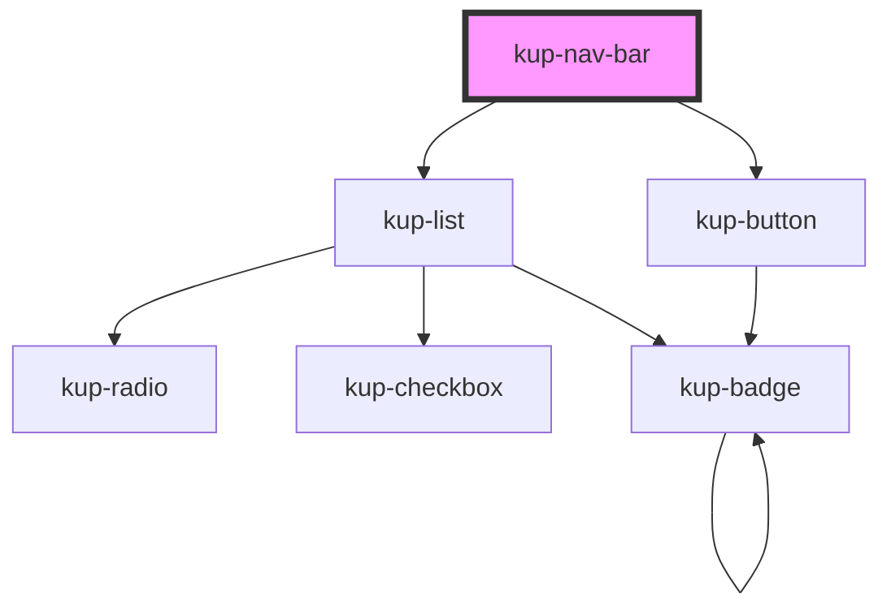

# kup-nav-bar

<!-- Auto Generated Below -->

## Properties

| Property      | Attribute      | Description                            | Type                                                                                                                                                     | Default                 |
| ------------- | -------------- | -------------------------------------- | -------------------------------------------------------------------------------------------------------------------------------------------------------- | ----------------------- |
| `customStyle` | `custom-style` | Custom style of the component.         | `string`                                                                                                                                                 | `''`                    |
| `data`        | --             | The actual data of the nav bar.        | `KupNavBarData`                                                                                                                                          | `null`                  |
| `mode`        | `mode`         | Defines how the bar will be displayed. | `KupNavBarMode.DEFAULT \| KupNavBarMode.DENSE \| KupNavBarMode.FIXED \| KupNavBarMode.PROMINENT \| KupNavBarMode.SHORT \| KupNavBarMode.SHORT_COLLAPSED` | `KupNavBarMode.DEFAULT` |

## Events

| Event                        | Description                                     | Type                                 |
| ---------------------------- | ----------------------------------------------- | ------------------------------------ |
| `kup-navbar-menuitemclick`   | Triggered when a button's list item is clicked. | `CustomEvent<KupNavbarEventPayload>` |
| `kup-navbar-optionitemclick` | Triggered when a button is clicked.             | `CustomEvent<KupNavbarEventPayload>` |

## Methods

### `getProps(descriptions?: boolean) => Promise<GenericObject>`

Used to retrieve component's props values.

#### Returns

Type: `Promise<GenericObject>`

### `refresh() => Promise<void>`

This method is used to trigger a new render of the component.

#### Returns

Type: `Promise<void>`

### `setProps(props: GenericObject) => Promise<void>`

Sets the props to the component.

#### Returns

Type: `Promise<void>`

## Dependencies

### Depends on

- [kup-list](../kup-list)
- [kup-button](../kup-button)

### Graph

----------------------------------------------

*Built with [StencilJS](https://stenciljs.com/)*
