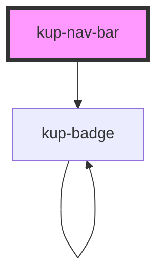

# kup-nav-bar

<!-- Auto Generated Below -->

## Properties

| Property         | Attribute          | Description                                                              | Type                                                                                                          | Default                     |
| ---------------- | ------------------ | ------------------------------------------------------------------------ | ------------------------------------------------------------------------------------------------------------- | --------------------------- |
| `customStyle`    | `custom-style`     | Custom style of the component.                                           | `string`                                                                                                      | `''`                        |
| `image`          | --                 | Image displayed by the nav bar, uses the kup-image component's props.    | `FImageProps`                                                                                                 | `null`                      |
| `label`          | `label`            | Text displayed by the nav bar.                                           | `string`                                                                                                      | `null`                      |
| `showMenuButton` | `show-menu-button` | When true, the menu button will be displayed on the left of the nav bar. | `boolean`                                                                                                     | `true`                      |
| `styling`        | `styling`          | Defines the style of the nav bar.                                        | `KupNavBarStyling.DENSE \| KupNavBarStyling.PROMINENT \| KupNavBarStyling.SHORT \| KupNavBarStyling.STANDARD` | `KupNavBarStyling.STANDARD` |

## Events

| Event                  | Description                                | Type                           |
| ---------------------- | ------------------------------------------ | ------------------------------ |
| `kup-navbar-menuclick` | Triggered when the menu button is clicked. | `CustomEvent<KupEventPayload>` |
| `kup-navbar-ready`     | Triggered when the component is ready.     | `CustomEvent<KupEventPayload>` |
| `kup-navbar-resize`    | Triggered when the component is resize.    | `CustomEvent<KupEventPayload>` |

## Methods

### `getProps(descriptions?: boolean) => Promise<GenericObject>`

Used to retrieve component's props values.

#### Returns

Type: `Promise<GenericObject>`

### `refresh() => Promise<void>`

This method is used to trigger a new render of the component.

#### Returns

Type: `Promise<void>`

### `resizeCallback() => Promise<void>`

This method is invoked by KupManager whenever the component changes size.

#### Returns

Type: `Promise<void>`

### `setProps(props: GenericObject) => Promise<void>`

Sets the props to the component.

#### Returns

Type: `Promise<void>`

## Dependencies

### Depends on

- [kup-badge](../kup-badge)

### Graph

----------------------------------------------

*Built with [StencilJS](https://stenciljs.com/)*
