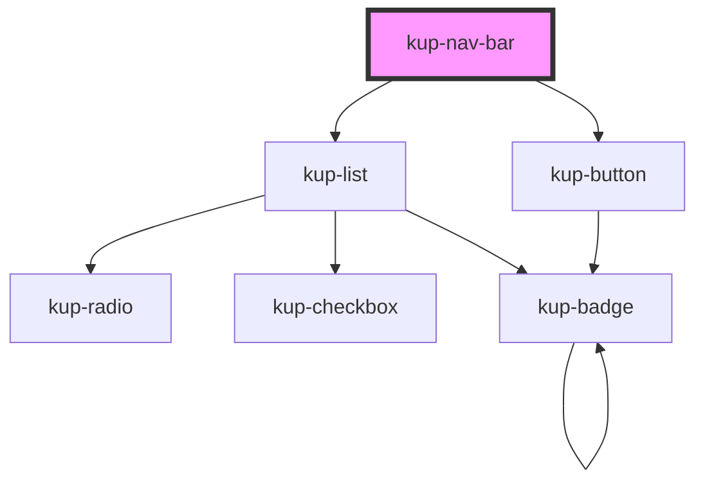

# kup-nav-bar

<!-- Auto Generated Below -->

## Properties

| Property      | Attribute      | Description                                                                                                     | Type                                                                                                                                                                                         | Default                                   |
| ------------- | -------------- | --------------------------------------------------------------------------------------------------------------- | -------------------------------------------------------------------------------------------------------------------------------------------------------------------------------------------- | ----------------------------------------- |
| `customStyle` | `custom-style` | Custom style of the component. For more information: https://ketchup.smeup.com/ketchup-showcase/#/customization | `string`                                                                                                                                                                                     | `undefined`                               |
| `data`        | --             | The actual data of the nav bar.                                                                                 | `ComponentNavBarData`                                                                                                                                                                        | `{         title: 'default title',     }` |
| `mode`        | `mode`         | Defines how the bar will be displayed.                                                                          | `ComponentNavBarMode.DEFAULT \| ComponentNavBarMode.DENSE \| ComponentNavBarMode.FIXED \| ComponentNavBarMode.PROMINENT \| ComponentNavBarMode.SHORT \| ComponentNavBarMode.SHORT_COLLAPSED` | `ComponentNavBarMode.DEFAULT`             |

## Events

| Event                        | Description | Type                                 |
| ---------------------------- | ----------- | ------------------------------------ |
| `kup-navbar-menuitemclick`   |             | `CustomEvent<KupNavbarEventPayload>` |
| `kup-navbar-optionitemclick` |             | `CustomEvent<KupNavbarEventPayload>` |

## Methods

### `getProps(descriptions?: boolean) => Promise<GenericObject>`

Used to retrieve component's props values.

#### Returns

Type: `Promise<GenericObject>`

### `refresh() => Promise<void>`

This method is used to trigger a new render of the component.

#### Returns

Type: `Promise<void>`

## Dependencies

### Depends on

- [kup-list](../kup-list)
- [kup-button](../kup-button)

### Graph

----------------------------------------------

*Built with [StencilJS](https://stenciljs.com/)*
