# kup-numeric-picker

<!-- Auto Generated Below -->

## Properties

| Property       | Attribute       | Description                                                                                           | Type      | Default |
| -------------- | --------------- | ----------------------------------------------------------------------------------------------------- | --------- | ------- |
| `customStyle`  | `custom-style`  | Custom style of the component.                                                                        | `string`  | `''`    |
| `data`         | --              | Props of the sub-components.                                                                          | `Object`  | `null`  |
| `decimals`     | `decimals`      | Defaults at false. When set to true, the component has decimals.                                      | `boolean` | `false` |
| `disabled`     | `disabled`      | Defaults at false. When set to true, the component is disabled.                                       | `boolean` | `false` |
| `initialValue` | `initial-value` | Sets the initial value of the component                                                               | `string`  | `''`    |
| `maxDecimals`  | `max-decimals`  | when set, the component allows you to enter decimals with a maximum of characters.                    | `number`  | `null`  |
| `maxIntegers`  | `max-integers`  | When set, the component allows you to enter integer numbers with a maximum of characters.             | `number`  | `null`  |
| `maxLength`    | `max-length`    | When set, the component allows you to enter numbers with a maximum of characters, including decimals. | `number`  | `null`  |
| `negative`     | `negative`      | Defaults at false. When set to true, the component has negative number.                               | `boolean` | `false` |

## Events

| Event                               | Description | Type                                        |
| ----------------------------------- | ----------- | ------------------------------------------- |
| `kup-numericpicker-blur`            |             | `CustomEvent<KupNumericPickerEventPayload>` |
| `kup-numericpicker-change`          |             | `CustomEvent<KupNumericPickerEventPayload>` |
| `kup-numericpicker-cleariconclick`  |             | `CustomEvent<KupEventPayload>`              |
| `kup-numericpicker-click`           |             | `CustomEvent<KupNumericPickerEventPayload>` |
| `kup-numericpicker-focus`           |             | `CustomEvent<KupNumericPickerEventPayload>` |
| `kup-numericpicker-iconclick`       |             | `CustomEvent<KupNumericPickerEventPayload>` |
| `kup-numericpicker-input`           |             | `CustomEvent<KupNumericPickerEventPayload>` |
| `kup-numericpicker-itemclick`       |             | `CustomEvent<KupNumericPickerEventPayload>` |
| `kup-numericpicker-textfieldsubmit` |             | `CustomEvent<KupNumericPickerEventPayload>` |

## Methods

### `getProps(descriptions?: boolean) => Promise<GenericObject>`

Used to retrieve component's props values.

#### Returns

Type: `Promise<GenericObject>`

List of props as object, each key will be a prop.

### `getValue() => Promise<string>`

Retrieves the component's value.

#### Returns

Type: `Promise<string>`

Value of the component.

### `refresh() => Promise<void>`

This method is used to trigger a new render of the component.

#### Returns

Type: `Promise<void>`

### `setFocus() => Promise<void>`

Sets the focus to the component.

#### Returns

Type: `Promise<void>`

### `setValue(value: string) => Promise<void>`

Sets the component's value.

#### Returns

Type: `Promise<void>`

## Dependencies

### Depends on

- [kup-card](../kup-card)

### Graph

```mermaid
graph TD;
  kup-numeric-picker --> kup-card
  kup-card --> kup-autocomplete
  kup-card --> kup-color-picker
  kup-card --> kup-combobox
  kup-card --> kup-date-picker
  kup-card --> kup-rating
  kup-card --> kup-time-picker
  kup-card --> kup-image
  kup-card --> kup-button
  kup-card --> kup-button-list
  kup-card --> kup-chart
  kup-card --> kup-gauge
  kup-card --> kup-progress-bar
  kup-card --> kup-radio
  kup-card --> kup-badge
  kup-card --> kup-chip
  kup-card --> kup-list
  kup-card --> kup-form
  kup-card --> kup-checkbox
  kup-card --> kup-text-field
  kup-card --> kup-data-table
  kup-card --> kup-spinner
  kup-card --> kup-tab-bar
  kup-card --> kup-tree
  kup-card --> kup-switch
  kup-card --> kup-dropdown-button
  kup-card --> kup-card
  kup-autocomplete --> kup-list
  kup-autocomplete --> kup-card
  kup-list --> kup-list
  kup-list --> kup-radio
  kup-list --> kup-card
  kup-list --> kup-badge
  kup-radio --> kup-card
  kup-badge --> kup-badge
  kup-badge --> kup-card
  kup-color-picker --> kup-card
  kup-combobox --> kup-list
  kup-combobox --> kup-card
  kup-date-picker --> kup-card
  kup-rating --> kup-card
  kup-time-picker --> kup-card
  kup-time-picker --> kup-list
  kup-image --> kup-spinner
  kup-image --> kup-card
  kup-image --> kup-badge
  kup-spinner --> kup-card
  kup-button --> kup-card
  kup-button --> kup-badge
  kup-button-list --> kup-dropdown-button
  kup-button-list --> kup-card
  kup-button-list --> kup-badge
  kup-dropdown-button --> kup-list
  kup-dropdown-button --> kup-card
  kup-dropdown-button --> kup-badge
  kup-chart --> kup-card
  kup-gauge --> kup-card
  kup-progress-bar --> kup-card
  kup-chip --> kup-card
  kup-chip --> kup-badge
  kup-form --> kup-card
  kup-form --> kup-autocomplete
  kup-form --> kup-color-picker
  kup-form --> kup-combobox
  kup-form --> kup-date-picker
  kup-form --> kup-rating
  kup-form --> kup-time-picker
  kup-form --> kup-image
  kup-form --> kup-button
  kup-form --> kup-button-list
  kup-form --> kup-chart
  kup-form --> kup-gauge
  kup-form --> kup-progress-bar
  kup-form --> kup-radio
  kup-form --> kup-badge
  kup-checkbox --> kup-card
  kup-text-field --> kup-card
  kup-data-table --> kup-card
  kup-data-table --> kup-list
  kup-data-table --> kup-switch
  kup-data-table --> kup-button
  kup-data-table --> kup-spinner
  kup-data-table --> kup-form
  kup-data-table --> kup-image
  kup-data-table --> kup-checkbox
  kup-data-table --> kup-combobox
  kup-data-table --> kup-badge
  kup-data-table --> kup-autocomplete
  kup-data-table --> kup-color-picker
  kup-data-table --> kup-date-picker
  kup-data-table --> kup-rating
  kup-data-table --> kup-time-picker
  kup-data-table --> kup-button-list
  kup-data-table --> kup-chart
  kup-data-table --> kup-gauge
  kup-data-table --> kup-progress-bar
  kup-data-table --> kup-radio
  kup-switch --> kup-card
  kup-tab-bar --> kup-card
  kup-tab-bar --> kup-badge
  kup-tree --> kup-card
  kup-tree --> kup-list
  kup-tree --> kup-text-field
  kup-tree --> kup-autocomplete
  kup-tree --> kup-color-picker
  kup-tree --> kup-combobox
  kup-tree --> kup-date-picker
  kup-tree --> kup-rating
  kup-tree --> kup-time-picker
  kup-tree --> kup-image
  kup-tree --> kup-button
  kup-tree --> kup-button-list
  kup-tree --> kup-chart
  kup-tree --> kup-gauge
  kup-tree --> kup-progress-bar
  kup-tree --> kup-radio
  kup-tree --> kup-badge
  style kup-numeric-picker fill:#f9f,stroke:#333,stroke-width:4px
```

----------------------------------------------

*Built with [StencilJS](https://stenciljs.com/)*
