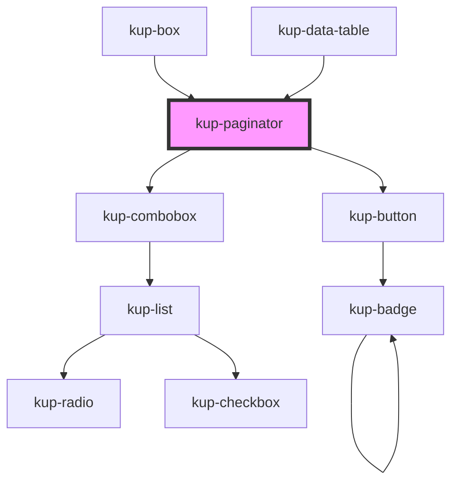

# kup-paginator

<!-- Auto Generated Below -->

## Properties

| Property          | Attribute           | Description | Type                                         | Default              |
| ----------------- | ------------------- | ----------- | -------------------------------------------- | -------------------- |
| `currentPage`     | `current-page`      |             | `number`                                     | `1`                  |
| `max`             | `max`               |             | `number`                                     | `0`                  |
| `mode`            | `mode`              |             | `PaginatorMode.FULL \| PaginatorMode.SIMPLE` | `PaginatorMode.FULL` |
| `perPage`         | `per-page`          |             | `number`                                     | `10`                 |
| `selectedPerPage` | `selected-per-page` |             | `number`                                     | `10`                 |

## Events

| Event                   | Description                   | Type                                       |
| ----------------------- | ----------------------------- | ------------------------------------------ |
| `kupPageChanged`        | When the current page change  | `CustomEvent<{ newPage: number; }>`        |
| `kupRowsPerPageChanged` | When the rows per page change | `CustomEvent<{ newRowsPerPage: number; }>` |

## Dependencies

### Used by

 - [kup-box](../kup-box)
 - [kup-data-table](../kup-data-table)

### Depends on

- [kup-button](../kup-button)
- [kup-combobox](../kup-combobox)

### Graph

----------------------------------------------

*Built with [StencilJS](https://stenciljs.com/)*
