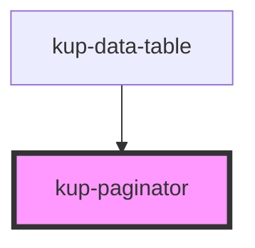

# kup-paginator

<!-- Auto Generated Below -->

## Properties

| Property          | Attribute           | Description | Type     | Default |
| ----------------- | ------------------- | ----------- | -------- | ------- |
| `currentPage`     | `current-page`      |             | `number` | `1`     |
| `max`             | `max`               |             | `number` | `0`     |
| `perPage`         | `per-page`          |             | `number` | `10`    |
| `selectedPerPage` | `selected-per-page` |             | `number` | `10`    |

## Events

| Event                   | Description                   | Type                                       |
| ----------------------- | ----------------------------- | ------------------------------------------ |
| `kupPageChanged`        | When the current page change  | `CustomEvent<{ newPage: number; }>`        |
| `kupRowsPerPageChanged` | When the rows per page change | `CustomEvent<{ newRowsPerPage: number; }>` |

## Dependencies

### Used by

 - [kup-data-table](..\kup-data-table)

### Graph

## CSS Custom Properties

| Name                                           | Description          |
| ---------------------------------------------- | -------------------- |
| `--int_font-size, --kup-paginator_font-size`   | Set size of the font |
| `--int_text-color, --kup-paginator_text-color` | Set color of text    |

----------------------------------------------

*Built with [StencilJS](https://stenciljs.com/)*
