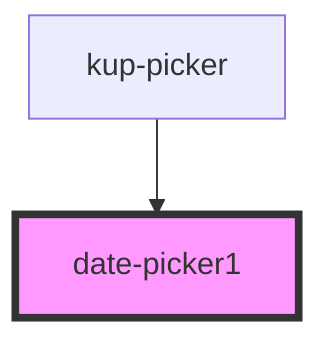

# date-picker

<!-- Auto Generated Below -->

## Properties

| Property | Attribute | Description | Type     | Default |
| -------- | --------- | ----------- | -------- | ------- |
| `value`  | `value`   |             | `string` | `''`    |

## Events

| Event                    | Description | Type                           |
| ------------------------ | ----------- | ------------------------------ |
| `datepickerValueUpdated` |             | `CustomEvent<{ value: any; }>` |

## Dependencies

### Used by

 - [kup-picker](..)

### Graph

----------------------------------------------

*Built with [StencilJS](https://stenciljs.com/)*
