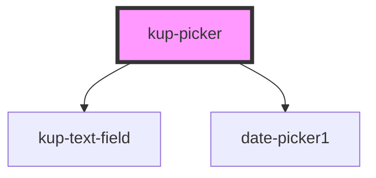

# kup-date-picker

<!-- Auto Generated Below -->

## Properties

| Property            | Attribute            | Description                                                                                                     | Type     | Default        |
| ------------------- | -------------------- | --------------------------------------------------------------------------------------------------------------- | -------- | -------------- |
| `customStyle`       | `custom-style`       | Custom style of the component. For more information: https://ketchup.smeup.com/ketchup-showcase/#/customization | `string` | `undefined`    |
| `dateInitialValue`  | `date-initial-value` | The value of the date picker.                                                                                   | `string` | `''`           |
| `dateMaxValue`      | `date-max-value`     | The maximum value of the date picker.                                                                           | `string` | `null`         |
| `dateMinValue`      | `date-min-value`     | The minimum value of the date picker.                                                                           | `string` | `'1970-01-01'` |
| `dateTextfieldData` | --                   | Props of the date text field.                                                                                   | `Object` | `{}`           |

## Events

| Event                | Description | Type                                                        |
| -------------------- | ----------- | ----------------------------------------------------------- |
| `kupPickerBlur`      |             | `CustomEvent<{ value: any; source: PICKER_SOURCE_EVENT; }>` |
| `kupPickerChange`    |             | `CustomEvent<{ value: any; source: PICKER_SOURCE_EVENT; }>` |
| `kupPickerClick`     |             | `CustomEvent<{ value: any; source: PICKER_SOURCE_EVENT; }>` |
| `kupPickerFocus`     |             | `CustomEvent<{ value: any; source: PICKER_SOURCE_EVENT; }>` |
| `kupPickerIconClick` |             | `CustomEvent<{ value: any; source: PICKER_SOURCE_EVENT; }>` |
| `kupPickerInput`     |             | `CustomEvent<{ value: any; source: PICKER_SOURCE_EVENT; }>` |
| `kupPickerItemClick` |             | `CustomEvent<{ value: any; source: PICKER_SOURCE_EVENT; }>` |

## Methods

### `refreshCustomStyle(customStyleTheme: string) => Promise<void>`

#### Returns

Type: `Promise<void>`

## Dependencies

### Depends on

- [kup-text-field](../kup-text-field)
- [date-picker1](date-picker-1)

### Graph

----------------------------------------------

*Built with [StencilJS](https://stenciljs.com/)*
