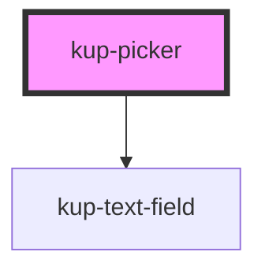

# kup-date-picker

<!-- Auto Generated Below -->

## Properties

| Property | Attribute | Description | Type | Default |
| --- | --- | --- | --- | --- |
| `dateInitialValue` | `date-initial-value` |  | `string` | `''` |
| `dateMaxValue` | `date-max-value` |  | `string` | `null` |
| `dateMinValue` | `date-min-value` |  | `string` | `'1970-01-01'` |
| `dateTextfieldData` | -- |  | `Object` | `{}` |

## Events

| Event | Description | Type |
| --- | --- | --- |
| `kupPickerBlur` | Events. | `CustomEvent<{ value: any; source: PICKER_SOURCE_EVENT; }>` |
| `kupPickerChange` |  | `CustomEvent<{ value: any; source: PICKER_SOURCE_EVENT; }>` |
| `kupPickerClick` |  | `CustomEvent<{ value: any; source: PICKER_SOURCE_EVENT; }>` |
| `kupPickerFocus` |  | `CustomEvent<{ value: any; source: PICKER_SOURCE_EVENT; }>` |
| `kupPickerIconClick` |  | `CustomEvent<{ value: any; source: PICKER_SOURCE_EVENT; }>` |
| `kupPickerInput` |  | `CustomEvent<{ value: any; source: PICKER_SOURCE_EVENT; }>` |
| `kupPickerItemClick` |  | `CustomEvent<{ value: any; source: PICKER_SOURCE_EVENT; }>` |

## Methods

### `refreshCustomStyle(customStyleTheme: string) => Promise<void>`

#### Returns

Type: `Promise<void>`

## Dependencies

### Depends on

-   [kup-text-field](../kup-text-field)

### Graph

---

_Built with [StencilJS](https://stenciljs.com/)_
