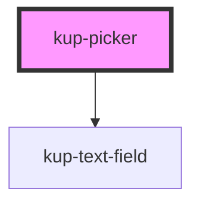

# kup-date-picker

<!-- Auto Generated Below -->

## Properties

| Property        | Attribute   | Description              | Type     | Default        |
| --------------- | ----------- | ------------------------ | -------- | -------------- |
| `maxValue`      | `max-value` |                          | `string` | `null`         |
| `minValue`      | `min-value` |                          | `string` | `'1970-01-01'` |
| `textfieldData` | --          | Props of the text field. | `Object` | `{}`           |
| `value`         | `value`     |                          | `string` | `''`           |

## Events

| Event                | Description | Type                           |
| -------------------- | ----------- | ------------------------------ |
| `kupPickerBlur`      | Events.     | `CustomEvent<{ value: any; }>` |
| `kupPickerChange`    |             | `CustomEvent<{ value: any; }>` |
| `kupPickerClick`     |             | `CustomEvent<{ value: any; }>` |
| `kupPickerFocus`     |             | `CustomEvent<{ value: any; }>` |
| `kupPickerIconClick` |             | `CustomEvent<{ value: any; }>` |
| `kupPickerInput`     |             | `CustomEvent<{ value: any; }>` |
| `kupPickerItemClick` |             | `CustomEvent<{ value: any; }>` |

## Methods

### `refreshCustomStyle(customStyleTheme: string) => Promise<void>`

#### Returns

Type: `Promise<void>`

## Dependencies

### Depends on

- [kup-text-field](../kup-text-field)

### Graph

----------------------------------------------

*Built with [StencilJS](https://stenciljs.com/)*
