# kup-gantt

<!-- Auto Generated Below -->

## Properties

| Property               | Attribute                 | Description                                                                          | Type                                             | Default     |
| ---------------------- | ------------------------- | ------------------------------------------------------------------------------------ | ------------------------------------------------ | ----------- |
| `customStyle`          | `custom-style`            | Custom style of the component.                                                       | `string`                                         | `''`        |
| `data`                 | --                        | Dataset containg the tasks list                                                      | `KupDataDataset`                                 | `undefined` |
| `detailColorCol`       | `detail-color-col`        | Column containing the detail color, in hex format                                    | `string`                                         | `undefined` |
| `detailColumns`        | --                        | Columns containing informations displayed in the left box, near the gantt of details | `string[]`                                       | `undefined` |
| `detailData`           | --                        | Dataset containg the details list                                                    | `KupDataDataset`                                 | `undefined` |
| `detailDates`          | --                        | Columns containing detail duration, from (firstDate) to (secondDate)                 | `string[]`                                       | `undefined` |
| `detailFilter`         | `detail-filter`           | Sets the detail's filter.                                                            | `string`                                         | `undefined` |
| `detailHeight`         | `detail-height`           | Height for detail gantt                                                              | `number`                                         | `undefined` |
| `detailHours`          | --                        | Columns containing detail hour duration, from (firstDate) to (secondDate)            | `string[]`                                       | `[]`        |
| `detailIconCol`        | `detail-icon-col`         | Column containing icon name to show, for detail                                      | `string`                                         | `undefined` |
| `detailIdCol`          | `detail-id-col`           | Column containing unique detail identifier                                           | `string`                                         | `undefined` |
| `detailInitialScrollX` | `detail-initial-scroll-x` | Sets the initial scroll X for the detail.                                            | `number`                                         | `undefined` |
| `detailInitialScrollY` | `detail-initial-scroll-y` | Sets the initial scroll Y for the detail.                                            | `number`                                         | `undefined` |
| `detailNameCol`        | `detail-name-col`         | Column containing detail name displayed                                              | `string`                                         | `undefined` |
| `detailPrevDates`      | --                        | Columns containing forecast detail duration, from (firstDate) to (secondDate)        | `string[]`                                       | `undefined` |
| `detailPrevHours`      | --                        | Columns containing forecast detail duration, from (firstHour) to (secondHour)        | `string[]`                                       | `[]`        |
| `listCellWidth`        | `list-cell-width`         | Total size of the cells inside to the left box, near the gantt                       | `string`                                         | `'300px'`   |
| `mainFilter`           | --                        | Sets the filter for main gantt.                                                      | `HTMLElement`                                    | `undefined` |
| `maxWidth`             | `max-width`               | Max width for component                                                              | `string`                                         | `'90vw'`    |
| `phaseColParDep`       | `phase-col-par-dep`       | Column containing the name of the parent phases                                      | `string`                                         | `undefined` |
| `phaseColorCol`        | `phase-color-col`         | Column containing the phase color in hex format                                      | `string`                                         | `undefined` |
| `phaseColumns`         | --                        | Columns containing informations displayed in the left box ,near the gantt of phases  | `string[]`                                       | `undefined` |
| `phaseDates`           | --                        | Columns containing phase duration, from (firstDate) to (secondDate)                  | `string[]`                                       | `undefined` |
| `phaseHours`           | --                        | Columns containing phase hour duration, from (firstDate) to (secondDate)             | `string[]`                                       | `[]`        |
| `phaseIconCol`         | `phase-icon-col`          | Column containing icon name to show, for phase                                       | `string`                                         | `undefined` |
| `phaseIdCol`           | `phase-id-col`            | Column containing unique phase identifier                                            | `string`                                         | `undefined` |
| `phaseNameCol`         | `phase-name-col`          | Column containing phase name displayed                                               | `string`                                         | `undefined` |
| `phasePrevDates`       | --                        | Columns containing forecast phase duration, from (firstDate) to (secondDate)         | `string[]`                                       | `undefined` |
| `phasePrevHours`       | --                        | Columns containing forecast phase duration, from (firstHour) to (secondHour)         | `string[]`                                       | `[]`        |
| `readOnly`             | `read-only`               | When true, the two gantts are not interactable.                                      | `boolean`                                        | `false`     |
| `scrollableTaskList`   | `scrollable-task-list`    | Sets the scroll bar for task list.                                                   | `boolean`                                        | `false`     |
| `secondaryFilter`      | --                        | Sets the filter for secondary gantt.                                                 | `HTMLElement`                                    | `undefined` |
| `showSecondaryDates`   | `show-secondary-dates`    | Enable/disable display of secondary dates                                            | `boolean`                                        | `false`     |
| `stateId`              | `state-id`                |                                                                                      | `string`                                         | `''`        |
| `store`                | --                        |                                                                                      | `KupStore`                                       | `undefined` |
| `taskColumns`          | --                        | Columns containing informations displayed in the left box, near the gantt            | `string[]`                                       | `undefined` |
| `taskDates`            | --                        | Columns containing task duration, from (firstDate) to (secondDate)                   | `string[]`                                       | `undefined` |
| `taskFilter`           | `task-filter`             | Sets the task's filter.                                                              | `string`                                         | `undefined` |
| `taskHeight`           | `task-height`             | Height for main gantt                                                                | `number`                                         | `undefined` |
| `taskHours`            | --                        | Columns containing task hours duration, from (firstDate) to (secondDate)             | `string[]`                                       | `[]`        |
| `taskIconCol`          | `task-icon-col`           | Column containing icon name to show, for task                                        | `string`                                         | `undefined` |
| `taskIdCol`            | `task-id-col`             | Column containing unique task identifier                                             | `string`                                         | `undefined` |
| `taskInitialScrollX`   | `task-initial-scroll-x`   | Sets the initial scroll X for the task.                                              | `number`                                         | `undefined` |
| `taskInitialScrollY`   | `task-initial-scroll-y`   | Sets the initial scroll Y for the task.                                              | `number`                                         | `undefined` |
| `taskNameCol`          | `task-name-col`           | Column containing task name displayed                                                | `string`                                         | `undefined` |
| `taskPrevDates`        | --                        | Columns containing forecast task duration, from (firstDate) to (secondDate)          | `string[]`                                       | `undefined` |
| `taskPrevHours`        | --                        | Columns containing forecast task duration, from (firstHour) to (secondHour)          | `string[]`                                       | `[]`        |
| `titleMess`            | `title-mess`              | Message displayed on top                                                             | `string`                                         | `undefined` |
| `viewMode`             | `view-mode`               | Sets the view mode.                                                                  | `"day" \| "hour" \| "month" \| "week" \| "year"` | `'month'`   |

## Events

| Event                     | Description                           | Type                                        |
| ------------------------- | ------------------------------------- | ------------------------------------------- |
| `kup-planner-click`       |                                       | `CustomEvent<KupPlannerEventPayload>`       |
| `kup-planner-contextmenu` | Generic right click event on planner. | `CustomEvent<KupPlannerClickEventPayload>`  |
| `kup-planner-datechange`  |                                       | `CustomEvent<KupPlannerEventPayload>`       |
| `kup-planner-dblclick`    |                                       | `CustomEvent<KupPlannerEventPayload>`       |
| `kup-planner-didunload`   | When component unload is complete     | `CustomEvent<KupPlannerUnloadEventPayload>` |
| `kup-planner-phasedrop`   |                                       | `CustomEvent<KupPlannerEventPayload>`       |
| `kup-planner-ready`       |                                       | `CustomEvent<KupPlannerEventPayload>`       |

## Methods

### `addPhases(taskId: string, data: KupDataDataset) => Promise<void>`

Add a list of phases to the project

#### Parameters

| Name     | Type             | Description                            |
| -------- | ---------------- | -------------------------------------- |
| `taskId` | `string`         |                                        |
| `data`   | `KupDataDataset` | - Matrix which contains project phases |

#### Returns

Type: `Promise<void>`

### `getProps(descriptions?: boolean) => Promise<GenericObject>`

Used to retrieve component's props values.

#### Parameters

| Name           | Type      | Description                                                                            |
| -------------- | --------- | -------------------------------------------------------------------------------------- |
| `descriptions` | `boolean` | - When provided and true, the result will be the list of props with their description. |

#### Returns

Type: `Promise<GenericObject>`

List of props as object, each key will be a prop.

### `refresh() => Promise<void>`

This method is used to trigger a new render of the component.

#### Returns

Type: `Promise<void>`

### `setProps(props: GenericObject) => Promise<void>`

Sets the props to the component.

#### Parameters

| Name    | Type            | Description                                                  |
| ------- | --------------- | ------------------------------------------------------------ |
| `props` | `GenericObject` | - Object containing props that will be set to the component. |

#### Returns

Type: `Promise<void>`

## Dependencies

### Depends on

- [kup-planner-renderer](utils)
- [kup-card](../kup-card)
- [kup-dialog](../kup-dialog)
- [kup-badge](../kup-badge)

### Graph

```mermaid
graph TD;
  kup-planner --> kup-planner-renderer
  kup-planner --> kup-card
  kup-planner --> kup-dialog
  kup-planner --> kup-badge
  kup-planner-renderer --> kup-switcher
  kup-planner-renderer --> kup-gantt
  kup-gantt --> kup-standard-tooltip
  kup-gantt --> kup-task-list-header
  kup-gantt --> kup-task-list-table
  kup-gantt --> kup-task-list
  kup-gantt --> kup-task-gantt
  kup-gantt --> kup-tooltip
  kup-gantt --> kup-vertical-scroll
  kup-gantt --> kup-horizontal-scroll
  kup-task-list --> kup-custom-task-list-header
  kup-task-list --> kup-custom-task-list-table
  kup-task-gantt --> kup-gantt-calendar
  kup-task-gantt --> kup-grid-renderer
  kup-card --> kup-image
  kup-card --> kup-autocomplete
  kup-card --> kup-chip
  kup-card --> kup-text-field
  kup-card --> kup-color-picker
  kup-card --> kup-combobox
  kup-card --> kup-date-picker
  kup-card --> kup-rating
  kup-card --> kup-time-picker
  kup-card --> kup-button-list
  kup-card --> kup-chart
  kup-card --> kup-gauge
  kup-card --> kup-progress-bar
  kup-card --> kup-badge
  kup-card --> kup-toolbar
  kup-card --> kup-card
  kup-card --> kup-dialog
  kup-card --> kup-button
  kup-card --> kup-list
  kup-card --> kup-spinner
  kup-card --> kup-checkbox
  kup-card --> kup-data-table
  kup-card --> kup-tab-bar
  kup-card --> kup-tree
  kup-card --> kup-switch
  kup-card --> kup-dropdown-button
  kup-image --> kup-card
  kup-image --> kup-image
  kup-image --> kup-dialog
  kup-image --> kup-spinner
  kup-image --> kup-badge
  kup-dialog --> kup-badge
  kup-dialog --> kup-card
  kup-dialog --> kup-dialog
  kup-badge --> kup-badge
  kup-badge --> kup-card
  kup-badge --> kup-dialog
  kup-spinner --> kup-card
  kup-spinner --> kup-dialog
  kup-autocomplete --> kup-list
  kup-autocomplete --> kup-card
  kup-autocomplete --> kup-dialog
  kup-autocomplete --> kup-badge
  kup-list --> kup-list
  kup-list --> kup-radio
  kup-list --> kup-card
  kup-list --> kup-dialog
  kup-list --> kup-badge
  kup-radio --> kup-card
  kup-radio --> kup-dialog
  kup-radio --> kup-badge
  kup-chip --> kup-card
  kup-chip --> kup-dialog
  kup-chip --> kup-badge
  kup-text-field --> kup-card
  kup-text-field --> kup-dialog
  kup-text-field --> kup-badge
  kup-color-picker --> kup-card
  kup-color-picker --> kup-dialog
  kup-color-picker --> kup-badge
  kup-combobox --> kup-list
  kup-combobox --> kup-card
  kup-combobox --> kup-dialog
  kup-combobox --> kup-badge
  kup-date-picker --> kup-card
  kup-date-picker --> kup-dialog
  kup-date-picker --> kup-badge
  kup-rating --> kup-card
  kup-rating --> kup-dialog
  kup-time-picker --> kup-card
  kup-time-picker --> kup-list
  kup-time-picker --> kup-dialog
  kup-time-picker --> kup-badge
  kup-button-list --> kup-dropdown-button
  kup-button-list --> kup-card
  kup-button-list --> kup-dialog
  kup-button-list --> kup-badge
  kup-dropdown-button --> kup-list
  kup-dropdown-button --> kup-card
  kup-dropdown-button --> kup-dialog
  kup-dropdown-button --> kup-badge
  kup-chart --> kup-card
  kup-chart --> kup-dialog
  kup-gauge --> kup-card
  kup-gauge --> kup-dialog
  kup-progress-bar --> kup-card
  kup-progress-bar --> kup-dialog
  kup-toolbar --> kup-card
  kup-toolbar --> kup-dialog
  kup-toolbar --> kup-badge
  kup-toolbar --> kup-image
  kup-toolbar --> kup-autocomplete
  kup-toolbar --> kup-chip
  kup-toolbar --> kup-text-field
  kup-toolbar --> kup-color-picker
  kup-toolbar --> kup-combobox
  kup-toolbar --> kup-date-picker
  kup-toolbar --> kup-rating
  kup-toolbar --> kup-time-picker
  kup-toolbar --> kup-button-list
  kup-toolbar --> kup-chart
  kup-toolbar --> kup-gauge
  kup-toolbar --> kup-progress-bar
  kup-toolbar --> kup-toolbar
  kup-button --> kup-card
  kup-button --> kup-dialog
  kup-button --> kup-badge
  kup-checkbox --> kup-card
  kup-checkbox --> kup-dialog
  kup-checkbox --> kup-badge
  kup-data-table --> kup-card
  kup-data-table --> kup-list
  kup-data-table --> kup-switch
  kup-data-table --> kup-button
  kup-data-table --> kup-spinner
  kup-data-table --> kup-form
  kup-data-table --> kup-image
  kup-data-table --> kup-dialog
  kup-data-table --> kup-checkbox
  kup-data-table --> kup-combobox
  kup-data-table --> kup-dropdown-button
  kup-data-table --> kup-badge
  kup-data-table --> kup-autocomplete
  kup-data-table --> kup-chip
  kup-data-table --> kup-text-field
  kup-data-table --> kup-color-picker
  kup-data-table --> kup-date-picker
  kup-data-table --> kup-rating
  kup-data-table --> kup-time-picker
  kup-data-table --> kup-button-list
  kup-data-table --> kup-chart
  kup-data-table --> kup-gauge
  kup-data-table --> kup-progress-bar
  kup-data-table --> kup-toolbar
  kup-switch --> kup-card
  kup-switch --> kup-dialog
  kup-form --> kup-card
  kup-form --> kup-dialog
  kup-form --> kup-image
  kup-form --> kup-autocomplete
  kup-form --> kup-chip
  kup-form --> kup-text-field
  kup-form --> kup-color-picker
  kup-form --> kup-combobox
  kup-form --> kup-date-picker
  kup-form --> kup-rating
  kup-form --> kup-time-picker
  kup-form --> kup-button-list
  kup-form --> kup-chart
  kup-form --> kup-gauge
  kup-form --> kup-progress-bar
  kup-form --> kup-badge
  kup-form --> kup-toolbar
  kup-tab-bar --> kup-toolbar
  kup-tab-bar --> kup-card
  kup-tab-bar --> kup-dialog
  kup-tab-bar --> kup-badge
  kup-tree --> kup-card
  kup-tree --> kup-list
  kup-tree --> kup-text-field
  kup-tree --> kup-dialog
  kup-tree --> kup-image
  kup-tree --> kup-autocomplete
  kup-tree --> kup-chip
  kup-tree --> kup-color-picker
  kup-tree --> kup-combobox
  kup-tree --> kup-date-picker
  kup-tree --> kup-rating
  kup-tree --> kup-time-picker
  kup-tree --> kup-button-list
  kup-tree --> kup-chart
  kup-tree --> kup-gauge
  kup-tree --> kup-progress-bar
  kup-tree --> kup-badge
  kup-tree --> kup-toolbar
  style kup-planner fill:#f9f,stroke:#333,stroke-width:4px
```

----------------------------------------------

*Built with [StencilJS](https://stenciljs.com/)*
