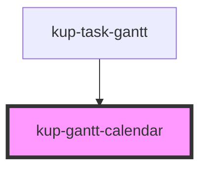

# kup-gantt-calendar

<!-- Auto Generated Below -->

## Properties

| Property               | Attribute            | Description | Type                                                                                                                                                                                                       | Default     |
| ---------------------- | -------------------- | ----------- | ---------------------------------------------------------------------------------------------------------------------------------------------------------------------------------------------------------- | ----------- |
| `columnWidth`          | `column-width`       |             | `number`                                                                                                                                                                                                   | `undefined` |
| `currentDateIndicator` | --                   |             | `CurrentDateIndicator`                                                                                                                                                                                     | `undefined` |
| `dateSetup`            | --                   |             | `DateSetup`                                                                                                                                                                                                | `undefined` |
| `dateTimeFormatters`   | --                   |             | `{ year?: DateTimeFormatter; month?: DateTimeFormatter; monthAndYear?: DateTimeFormatter; week?: DateTimeFormatter; day?: DateTimeFormatter; hour?: DateTimeFormatter; dayAndMonth?: DateTimeFormatter; }` | `undefined` |
| `fontFamily`           | `font-family`        |             | `string`                                                                                                                                                                                                   | `undefined` |
| `fontSize`             | `font-size`          |             | `string`                                                                                                                                                                                                   | `undefined` |
| `headerHeight`         | `header-height`      |             | `number`                                                                                                                                                                                                   | `undefined` |
| `locale`               | `locale`             |             | `string`                                                                                                                                                                                                   | `undefined` |
| `rtl`                  | `rtl`                |             | `boolean`                                                                                                                                                                                                  | `undefined` |
| `singleLineHeader`     | `single-line-header` |             | `boolean`                                                                                                                                                                                                  | `false`     |
| `svgWidth`             | `svg-width`          |             | `number`                                                                                                                                                                                                   | `undefined` |

## Dependencies

### Used by

 - [kup-task-gantt](../kup-task-gantt)

### Graph

----------------------------------------------

*Built with [StencilJS](https://stenciljs.com/)*
