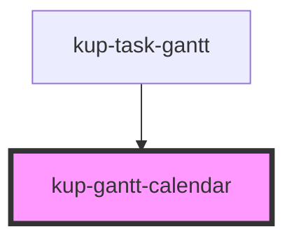

# kup-gantt-calendar

<!-- Auto Generated Below -->

## Properties

| Property | Attribute | Description | Type | Default |
| --- | --- | --- | --- | --- |
| `columnWidth` | `column-width` |  | `number` | `undefined` |
| `currentDateIndicator` | -- |  | `KupPlannerCurrentDateIndicator` | `undefined` |
| `dateSetup` | -- |  | `KupPlannerDateSetup` | `undefined` |
| `dateTimeFormatters` | -- |  | `{ year?: KupPlannerDateTimeFormatter; month?: KupPlannerDateTimeFormatter; monthAndYear?: KupPlannerDateTimeFormatter; week?: KupPlannerDateTimeFormatter; day?: KupPlannerDateTimeFormatter; hour?: KupPlannerDateTimeFormatter; dayAndMonth?: KupPlannerDateTimeFormatter; }` | `undefined` |
| `fontFamily` | `font-family` |  | `string` | `undefined` |
| `fontSize` | `font-size` |  | `string` | `undefined` |
| `headerHeight` | `header-height` |  | `number` | `undefined` |
| `locale` | `locale` |  | `string` | `undefined` |
| `rtl` | `rtl` |  | `boolean` | `undefined` |
| `singleLineHeader` | `single-line-header` |  | `boolean` | `false` |
| `svgWidth` | `svg-width` |  | `number` | `undefined` |

## Dependencies

### Used by

-   [kup-task-gantt](../kup-task-gantt)

### Graph

---

_Built with [StencilJS](https://stenciljs.com/)_
