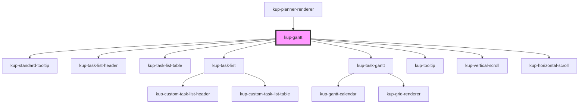

# kup-gantt

<!-- Auto Generated Below -->

## Properties

| Property                         | Attribute                           | Description | Type                                                                                                                                                                                                                                                                             | Default                                                                             |
| -------------------------------- | ----------------------------------- | ----------- | -------------------------------------------------------------------------------------------------------------------------------------------------------------------------------------------------------------------------------------------------------------------------------- | ----------------------------------------------------------------------------------- |
| `TaskListHeader`                 | --                                  |             | `Element \| FunctionalComponent<{ headerHeight: number; rowWidth: string; fontFamily: string; fontSize: string; }>`                                                                                                                                                              | `(         <kup-task-list-header />     )`                                          |
| `TaskListTable`                  | --                                  |             | `Element \| (FunctionalComponent<{ rowHeight: number; rowWidth: string; fontFamily: string; fontSize: string; locale: string; tasks: KupPlannerTask[]; selectedTaskId: string; setSelectedTask: (taskId: string) => void; onExpanderClick: (task: KupPlannerTask) => void; }>)`  | `(         <kup-task-list-table />     )`                                           |
| `TooltipContent`                 | --                                  |             | `(props: { task: KupPlannerTask; fontSize: string; fontFamily: string; }) => Element`                                                                                                                                                                                            | `(         <kup-standard-tooltip />     )`                                          |
| `arrowColor`                     | `arrow-color`                       |             | `string`                                                                                                                                                                                                                                                                         | `'grey'`                                                                            |
| `arrowIndent`                    | `arrow-indent`                      |             | `number`                                                                                                                                                                                                                                                                         | `20`                                                                                |
| `barBackgroundColor`             | `bar-background-color`              |             | `string`                                                                                                                                                                                                                                                                         | `'#b8c2cc'`                                                                         |
| `barBackgroundSelectedColor`     | `bar-background-selected-color`     |             | `string`                                                                                                                                                                                                                                                                         | `'#aeb8c2'`                                                                         |
| `barClick`                       | --                                  |             | `(task: KupPlannerTask) => void`                                                                                                                                                                                                                                                 | `undefined`                                                                         |
| `barContextMenu`                 | --                                  |             | `(event: UIEvent, task: KupPlannerTask) => void`                                                                                                                                                                                                                                 | `undefined`                                                                         |
| `barCornerRadius`                | `bar-corner-radius`                 |             | `number`                                                                                                                                                                                                                                                                         | `3`                                                                                 |
| `barDblClick`                    | --                                  |             | `(task: KupPlannerTask) => void`                                                                                                                                                                                                                                                 | `undefined`                                                                         |
| `barFill`                        | `bar-fill`                          |             | `number`                                                                                                                                                                                                                                                                         | `60`                                                                                |
| `barProgressColor`               | `bar-progress-color`                |             | `string`                                                                                                                                                                                                                                                                         | `'#a3a3ff'`                                                                         |
| `barProgressSelectedColor`       | `bar-progress-selected-color`       |             | `string`                                                                                                                                                                                                                                                                         | `'#8282f5'`                                                                         |
| `columnWidth`                    | `column-width`                      |             | `number`                                                                                                                                                                                                                                                                         | `60`                                                                                |
| `currentTasks`                   | --                                  |             | `KupPlannerGanttTaskN[] \| KupPlannerItemDetail[]`                                                                                                                                                                                                                               | `[]`                                                                                |
| `dateChange`                     | --                                  |             | `(task: KupPlannerTask, children: KupPlannerTask[]) => boolean \| void \| Promise<boolean> \| Promise<void>`                                                                                                                                                                     | `undefined`                                                                         |
| `dateTimeFormatters`             | --                                  |             | `{ year?: KupPlannerDateTimeFormatter; month?: KupPlannerDateTimeFormatter; monthAndYear?: KupPlannerDateTimeFormatter; week?: KupPlannerDateTimeFormatter; day?: KupPlannerDateTimeFormatter; hour?: KupPlannerDateTimeFormatter; dayAndMonth?: KupPlannerDateTimeFormatter; }` | `undefined`                                                                         |
| `delete`                         | --                                  |             | `(task: KupPlannerTask) => boolean \| void \| Promise<boolean> \| Promise<void>`                                                                                                                                                                                                 | `undefined`                                                                         |
| `dependencies`                   | --                                  |             | `KupPlannerDependency[]`                                                                                                                                                                                                                                                         | `[]`                                                                                |
| `displayedEndDate`               | --                                  |             | `Date`                                                                                                                                                                                                                                                                           | `undefined`                                                                         |
| `displayedStartDate`             | --                                  |             | `Date`                                                                                                                                                                                                                                                                           | `undefined`                                                                         |
| `doubleClick`                    | --                                  |             | `(task: KupPlannerTask) => void`                                                                                                                                                                                                                                                 | `undefined`                                                                         |
| `doubleView`                     | `double-view`                       |             | `boolean`                                                                                                                                                                                                                                                                        | `undefined`                                                                         |
| `expanderClick`                  | --                                  |             | `(task: KupPlannerTask) => void`                                                                                                                                                                                                                                                 | `undefined`                                                                         |
| `filter`                         | --                                  |             | `HTMLElement`                                                                                                                                                                                                                                                                    | `undefined`                                                                         |
| `fontFamily`                     | `font-family`                       |             | `string`                                                                                                                                                                                                                                                                         | `'Arial, Roboto, Oxygen, Ubuntu, Cantarell, Fira Sans, Droid Sans, Helvetica Neue'` |
| `fontSize`                       | `font-size`                         |             | `string`                                                                                                                                                                                                                                                                         | `'14px'`                                                                            |
| `ganttHeight`                    | `gantt-height`                      |             | `number`                                                                                                                                                                                                                                                                         | `0`                                                                                 |
| `ganttId`                        | `gantt-id`                          |             | `string`                                                                                                                                                                                                                                                                         | `undefined`                                                                         |
| `ganttOnClick`                   | --                                  |             | `(row: KupPlannerGanttRow) => void`                                                                                                                                                                                                                                              | `undefined`                                                                         |
| `ganttOnDblClick`                | --                                  |             | `(row: KupPlannerGanttRow) => void`                                                                                                                                                                                                                                              | `undefined`                                                                         |
| `ganttonOnContextMenu`           | --                                  |             | `(event: MouseEvent, row: KupPlannerGanttRow) => void`                                                                                                                                                                                                                           | `undefined`                                                                         |
| `handleClick`                    | --                                  |             | `(row: KupPlannerGanttRow, onClick: any) => void`                                                                                                                                                                                                                                | `undefined`                                                                         |
| `handleContextMenu`              | --                                  |             | `(event: MouseEvent, row: KupPlannerGanttRow, onContextMenu: any) => void`                                                                                                                                                                                                       | `undefined`                                                                         |
| `handleDblClick`                 | --                                  |             | `(row: KupPlannerGanttRow, onDblClick: any) => void`                                                                                                                                                                                                                             | `undefined`                                                                         |
| `handleWidth`                    | `handle-width`                      |             | `number`                                                                                                                                                                                                                                                                         | `8`                                                                                 |
| `headerHeight`                   | `header-height`                     |             | `number`                                                                                                                                                                                                                                                                         | `114`                                                                               |
| `hideDependencies`               | `hide-dependencies`                 |             | `boolean`                                                                                                                                                                                                                                                                        | `false`                                                                             |
| `hideLabel`                      | `hide-label`                        |             | `boolean`                                                                                                                                                                                                                                                                        | `false`                                                                             |
| `initialScrollX`                 | `initial-scroll-x`                  |             | `number`                                                                                                                                                                                                                                                                         | `-1`                                                                                |
| `initialScrollY`                 | `initial-scroll-y`                  |             | `number`                                                                                                                                                                                                                                                                         | `0`                                                                                 |
| `label`                          | `label`                             |             | `string`                                                                                                                                                                                                                                                                         | `undefined`                                                                         |
| `listCellWidth`                  | `list-cell-width`                   |             | `string`                                                                                                                                                                                                                                                                         | `'300px'`                                                                           |
| `locale`                         | `locale`                            |             | `string`                                                                                                                                                                                                                                                                         | `'en-GB'`                                                                           |
| `phaseDrop`                      | --                                  |             | `(originalPhaseData: KupPlannerTask, originalTaskData: KupPlannerTask, finalPhaseData: KupPlannerTask, destinationData: KupPlannerTask) => boolean \| void \| Promise<boolean> \| Promise<void>`                                                                                 | `undefined`                                                                         |
| `preStepsCount`                  | `pre-steps-count`                   |             | `number`                                                                                                                                                                                                                                                                         | `1`                                                                                 |
| `progressChange`                 | --                                  |             | `(task: KupPlannerTask, children: KupPlannerTask[]) => boolean \| void \| Promise<boolean> \| Promise<void>`                                                                                                                                                                     | `undefined`                                                                         |
| `projectBackgroundColor`         | `project-background-color`          |             | `string`                                                                                                                                                                                                                                                                         | `'#fac465'`                                                                         |
| `projectBackgroundSelectedColor` | `project-background-selected-color` |             | `string`                                                                                                                                                                                                                                                                         | `'#f7bb53'`                                                                         |
| `projectFill`                    | `project-fill`                      |             | `number`                                                                                                                                                                                                                                                                         | `80`                                                                                |
| `projectProgressColor`           | `project-progress-color`            |             | `string`                                                                                                                                                                                                                                                                         | `'#7db59a'`                                                                         |
| `projectProgressSelectedColor`   | `project-progress-selected-color`   |             | `string`                                                                                                                                                                                                                                                                         | `'#59a985'`                                                                         |
| `projection`                     | --                                  |             | `KupPlannerGanttPhaseProjection`                                                                                                                                                                                                                                                 | `undefined`                                                                         |
| `readOnly`                       | `read-only`                         |             | `boolean`                                                                                                                                                                                                                                                                        | `undefined`                                                                         |
| `rowHeight`                      | `row-height`                        |             | `number`                                                                                                                                                                                                                                                                         | `50`                                                                                |
| `rtl`                            | `rtl`                               |             | `boolean`                                                                                                                                                                                                                                                                        | `false`                                                                             |
| `scrollXChange`                  | --                                  |             | `(x: number) => void`                                                                                                                                                                                                                                                            | `undefined`                                                                         |
| `scrollYChange`                  | --                                  |             | `(y: number) => void`                                                                                                                                                                                                                                                            | `undefined`                                                                         |
| `scrollableTaskList`             | `scrollable-task-list`              |             | `boolean`                                                                                                                                                                                                                                                                        | `undefined`                                                                         |
| `select`                         | --                                  |             | `(task: KupPlannerTask, isSelected: boolean) => void`                                                                                                                                                                                                                            | `undefined`                                                                         |
| `setDoubleView`                  | --                                  |             | `(checked: boolean) => void`                                                                                                                                                                                                                                                     | `undefined`                                                                         |
| `showSecondaryDates`             | `show-secondary-dates`              |             | `boolean`                                                                                                                                                                                                                                                                        | `false`                                                                             |
| `singleLineHeader`               | `single-line-header`                |             | `boolean`                                                                                                                                                                                                                                                                        | `false`                                                                             |
| `tasks`                          | --                                  |             | `KupPlannerTask[]`                                                                                                                                                                                                                                                               | `undefined`                                                                         |
| `timeStep`                       | `time-step`                         |             | `number`                                                                                                                                                                                                                                                                         | `300000`                                                                            |
| `timelineFill`                   | `timeline-fill`                     |             | `number`                                                                                                                                                                                                                                                                         | `40`                                                                                |
| `todayColor`                     | `today-color`                       |             | `string`                                                                                                                                                                                                                                                                         | `'#ff0000'`                                                                         |
| `viewDate`                       | --                                  |             | `Date`                                                                                                                                                                                                                                                                           | `undefined`                                                                         |
| `viewMode`                       | `view-mode`                         |             | `"day" \| "hour" \| "month" \| "week" \| "year"`                                                                                                                                                                                                                                 | `'month'`                                                                           |

## Methods

### `refresh() => Promise<void>`

This method is used to trigger a new render of the component.

#### Returns

Type: `Promise<void>`

## Dependencies

### Used by

 - [kup-planner-renderer](..)

### Depends on

- [kup-standard-tooltip](../kup-tooltip)
- [kup-task-list-header](../kup-task-list)
- [kup-task-list-table](../kup-task-list)
- [kup-task-list](../kup-task-list)
- [kup-task-gantt](../kup-task-gantt)
- [kup-tooltip](../kup-tooltip)
- [kup-vertical-scroll](../kup-vertical-scroll)
- [kup-horizontal-scroll](../kup-horizontal-scroll)

### Graph

----------------------------------------------

*Built with [StencilJS](https://stenciljs.com/)*
