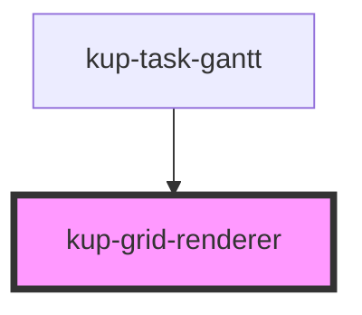

# kup-grid-renderer

<!-- Auto Generated Below -->

## Properties

| Property               | Attribute              | Description                                        | Type                                                                                                                                                                                             | Default     |
| ---------------------- | ---------------------- | -------------------------------------------------- | ------------------------------------------------------------------------------------------------------------------------------------------------------------------------------------------------ | ----------- |
| `arrowColor`           | `arrow-color`          |                                                    | `string`                                                                                                                                                                                         | `''`        |
| `arrowIndent`          | `arrow-indent`         |                                                    | `number`                                                                                                                                                                                         | `0`         |
| `barClick`             | --                     |                                                    | `(task: KupPlannerTask) => void`                                                                                                                                                                 | `undefined` |
| `barContextMenu`       | --                     |                                                    | `(event: UIEvent, task: KupPlannerTask) => void`                                                                                                                                                 | `undefined` |
| `barDblClick`          | --                     |                                                    | `(task: KupPlannerTask) => void`                                                                                                                                                                 | `undefined` |
| `columnWidth`          | `column-width`         |                                                    | `number`                                                                                                                                                                                         | `0`         |
| `currentDateIndicator` | --                     |                                                    | `KupPlannerCurrentDateIndicator`                                                                                                                                                                 | `undefined` |
| `dateChange`           | --                     |                                                    | `(task: KupPlannerTask, children: KupPlannerTask[]) => boolean \| void \| Promise<boolean> \| Promise<void>`                                                                                     | `undefined` |
| `dates`                | --                     |                                                    | `Date[]`                                                                                                                                                                                         | `undefined` |
| `delete`               | --                     |                                                    | `(task: KupPlannerTask) => boolean \| void \| Promise<boolean> \| Promise<void>`                                                                                                                 | `undefined` |
| `dependencies`         | --                     | Optional structured dependencies to draw as arrows | `KupPlannerDependency[]`                                                                                                                                                                         | `[]`        |
| `doubleClick`          | --                     |                                                    | `(task: KupPlannerTask) => void`                                                                                                                                                                 | `undefined` |
| `eMouseDown`           | --                     |                                                    | `(event: MouseEvent) => void`                                                                                                                                                                    | `undefined` |
| `eventStart`           | --                     |                                                    | `(action: KupPlannerGanttContentMoveAction, selectedTask: KupPlannerBarTask, event?: KeyboardEvent \| MouseEvent) => any`                                                                        | `undefined` |
| `fontFamily`           | `font-family`          |                                                    | `string`                                                                                                                                                                                         | `''`        |
| `fontSize`             | `font-size`            |                                                    | `string`                                                                                                                                                                                         | `''`        |
| `ganttEvent`           | --                     |                                                    | `{ changedTask?: KupPlannerBarTask; originalSelectedTask?: KupPlannerBarTask; action: KupPlannerGanttContentMoveAction; }`                                                                       | `undefined` |
| `gridProps`            | --                     |                                                    | `{ tasks: KupPlannerTask[]; dates: Date[]; svgWidth: number; rowHeight: number; columnWidth: number; todayColor: string; rtl: boolean; }`                                                        | `undefined` |
| `hideLabel`            | `hide-label`           |                                                    | `boolean`                                                                                                                                                                                        | `false`     |
| `phaseDragScroll`      | --                     |                                                    | `(scrollY: number) => void`                                                                                                                                                                      | `undefined` |
| `phaseDrop`            | --                     |                                                    | `(originalPhaseData: KupPlannerTask, originalTaskData: KupPlannerTask, finalPhaseData: KupPlannerTask, destinationData: KupPlannerTask) => boolean \| void \| Promise<boolean> \| Promise<void>` | `undefined` |
| `progressChange`       | --                     |                                                    | `(task: KupPlannerTask, children: KupPlannerTask[]) => boolean \| void \| Promise<boolean> \| Promise<void>`                                                                                     | `undefined` |
| `projection`           | --                     |                                                    | `{ x0: number; xf: number; color: string; }`                                                                                                                                                     | `undefined` |
| `readOnly`             | `read-only`            |                                                    | `boolean`                                                                                                                                                                                        | `false`     |
| `rowHeight`            | `row-height`           |                                                    | `number`                                                                                                                                                                                         | `0`         |
| `rtl`                  | `rtl`                  |                                                    | `boolean`                                                                                                                                                                                        | `false`     |
| `selectedTask`         | --                     |                                                    | `KupPlannerBarTask`                                                                                                                                                                              | `undefined` |
| `setFailedTask`        | --                     |                                                    | `(value: KupPlannerBarTask) => void`                                                                                                                                                             | `undefined` |
| `setGanttEvent`        | --                     |                                                    | `(gantt: KupPlannerGanttEvent) => void`                                                                                                                                                          | `undefined` |
| `setSelectedTask`      | --                     |                                                    | `(taskId: string) => void`                                                                                                                                                                       | `undefined` |
| `showSecondaryDates`   | `show-secondary-dates` |                                                    | `boolean`                                                                                                                                                                                        | `false`     |
| `taskHeight`           | `task-height`          |                                                    | `number`                                                                                                                                                                                         | `0`         |
| `tasks`                | --                     |                                                    | `KupPlannerBarTask[]`                                                                                                                                                                            | `undefined` |
| `timeStep`             | `time-step`            |                                                    | `number`                                                                                                                                                                                         | `0`         |

## Dependencies

### Used by

 - [kup-task-gantt](../kup-task-gantt)

### Graph

----------------------------------------------

*Built with [StencilJS](https://stenciljs.com/)*
