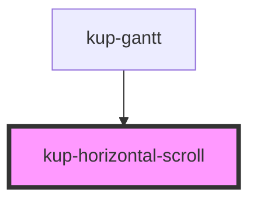

# kup-horizontal-scroll

<!-- Auto Generated Below -->

## Properties

| Property                   | Attribute                 | Description | Type                       | Default     |
| -------------------------- | ------------------------- | ----------- | -------------------------- | ----------- |
| `horizontalScroll`         | --                        |             | `(event: UIEvent) => void` | `undefined` |
| `horizontalTaskListScroll` | --                        |             | `(event: UIEvent) => void` | `undefined` |
| `listCellWidth`            | `list-cell-width`         |             | `string`                   | `'300px'`   |
| `rtl`                      | `rtl`                     |             | `boolean`                  | `undefined` |
| `scrollNumber`             | `scroll-number`           |             | `number`                   | `undefined` |
| `scrollableTaskList`       | `scrollable-task-list`    |             | `boolean`                  | `false`     |
| `svgWidth`                 | `svg-width`               |             | `number`                   | `undefined` |
| `taskListScrollNumber`     | `task-list-scroll-number` |             | `number`                   | `undefined` |
| `taskListScrollWidth`      | `task-list-scroll-width`  |             | `number`                   | `undefined` |
| `taskListTrueRef`          | --                        |             | `HTMLKupTaskListElement`   | `undefined` |
| `taskListWidth`            | `task-list-width`         |             | `number`                   | `undefined` |

## Dependencies

### Used by

 - [kup-gantt](../kup-gantt)

### Graph

----------------------------------------------

*Built with [StencilJS](https://stenciljs.com/)*
