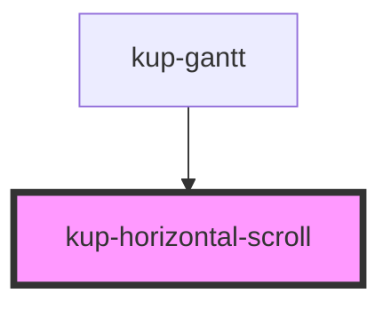

# kup-horizontal-scroll

<!-- Auto Generated Below -->

## Properties

| Property           | Attribute         | Description | Type                       | Default     |
| ------------------ | ----------------- | ----------- | -------------------------- | ----------- |
| `horizontalScroll` | --                |             | `(event: UIEvent) => void` | `undefined` |
| `rtl`              | `rtl`             |             | `boolean`                  | `undefined` |
| `scrollNumber`     | `scroll-number`   |             | `number`                   | `undefined` |
| `svgWidth`         | `svg-width`       |             | `number`                   | `undefined` |
| `taskGanttRef`     | --                |             | `HTMLDivElement`           | `undefined` |
| `taskListWidth`    | `task-list-width` |             | `number`                   | `undefined` |

## Dependencies

### Used by

 - [kup-gantt](../kup-gantt)

### Graph

----------------------------------------------

*Built with [StencilJS](https://stenciljs.com/)*
