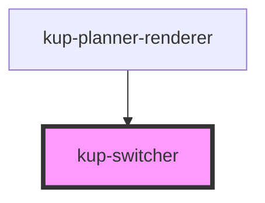

# kup-switcher

<!-- Auto Generated Below -->

## Properties

| Property | Attribute | Description | Type | Default |
| --- | --- | --- | --- | --- |
| `timeUnitChange` | -- |  | `(timeUnit: KupPlannerViewMode) => void` | `undefined` |

## Dependencies

### Used by

-   [kup-planner-renderer](..)

### Graph

---

_Built with [StencilJS](https://stenciljs.com/)_
